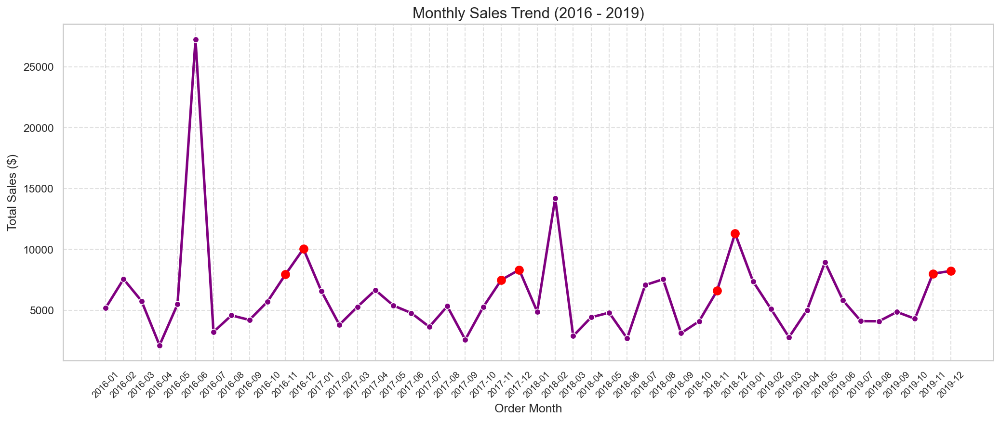
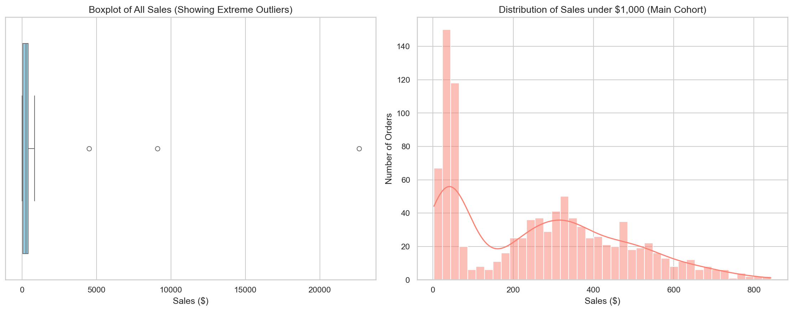
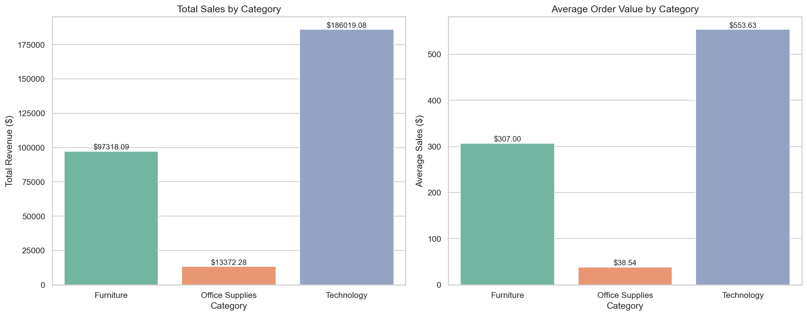
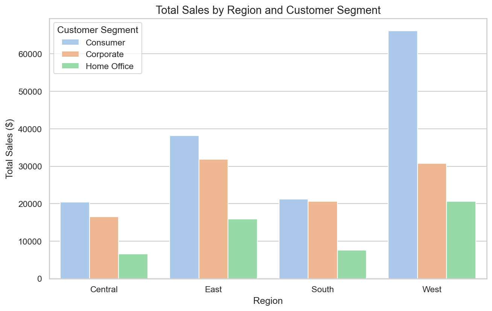
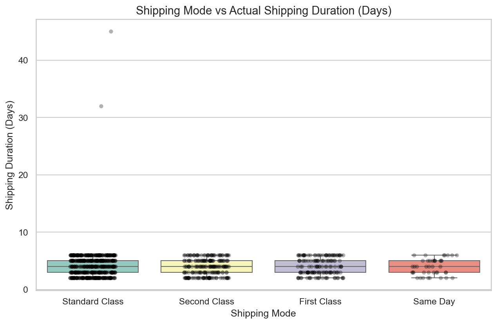

# Day 8: Finding Hidden Patterns Through EDA

Today's focus is on Exploratory Data Analysis (EDA)—using statistics and visualizations to extract real business value and catch data anomalies before modeling.

## Objective
To load the sales dataset, analyze its distribution and relationships, identify patterns, trends, and anomalies, and extract at least 5 actionable business insights.

## Project Files
*   [day8_eda.ipynb](day8_eda.ipynb): The Jupyter notebook containing the full EDA, visualizations, and annotations.
*   [sales_data.csv](sales_data.csv): The retail sales dataset used for analysis (mimicking Superstore Sales schema).
*   [generate_data.py](generate_data.py): The Python script used to generate the dataset.

---

## Actionable Business Insights

### 1. Strong Holiday Seasonality (Q4 Spikes)
Every year (2016-2019), sales spike dramatically in **November and December**. Total monthly sales during these months are 2x to 3x higher than standard months.
*   **Business Action:** Scale up warehouse inventory, hire temporary seasonal logistics staff by mid-October, and launch holiday marketing campaigns early to capture maximum demand.

### 2. High-Value B2B Outliers
A tiny fraction of orders (under 0.5%) represent extremely high-value transactions (e.g., a \$22.6k Copier, a \$9k 3D Printer, and a \$4.5k Custom Conference Table). These wholesale/B2B purchases skew the average order value and can bias standard retail forecasting models.
*   **Business Action:** Route large B2B clients into a dedicated corporate account program with volume discounts and personalized account managers. We should also segment these out during ML modeling.

### 3. Category Sales Strategy (Tech vs Office Supplies)
*   **Technology** is our highest value driver, with an average order value of **\$553.63** (Total category sales are high but frequency is low).
*   **Office Supplies** has a tiny average order value (**\$38.54**), but represents the highest number of transactions.
*   **Business Action:** Treat Office Supplies as a "loss-leader" or hook—running bundles and promotions to attract high-frequency shoppers, then cross-sell high-margin Technology items.

### 4. Coastal Domination (East & West)
The **West** and **East** regions are our largest markets by far, while the **South** lags behind significantly. In all regions, the **Consumer** segment contributes the most revenue.
*   **Business Action:** Dive deeper into the South region's performance. Determine if it suffers from a lack of marketing, slow shipping, or poor product-market fit. Reallocate marketing spend accordingly.

### 5. Catching Data Anomalies (Logistics/ERP issues)
During EDA, we uncovered two critical data quality issues:
1.  **Negative Shipping Times:** A couple of records had shipping dates that occurred *before* the order date (e.g. Row ID 16 and 151).
2.  **Severe Shipping Delays:** Two records took 32 and 45 days to ship under Standard Class, which is abnormal.
*   **Business Action:** Feedback these findings to the IT/ERP team. We need to implement system-level form validation (e.g., `Ship Date >= Order Date`) and flag shipping delay tickets in real-time.

