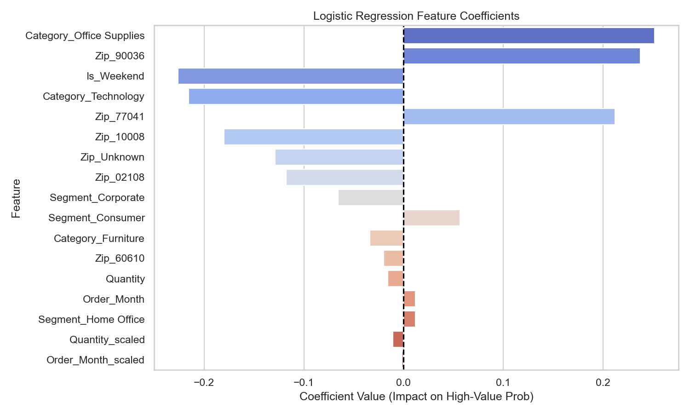

# Day 11: Building Your First ML Pipeline — End-to-End Classification

Welcome to Day 11 of the **60-Day Data Science Challenge**! Today marks a massive milestone: moving from data processing and feature engineering to building an **end-to-end Machine Learning Pipeline**.

Using the normalized, scaled, and encoded retail transactions dataset from Day 10, I designed a binary classification pipeline to predict whether a customer transaction is a **High-Value Sale** (sales value above the dataset's median of $250.28).

---

## Project Files
*   [day11_ml_pipeline.ipynb](day11_ml_pipeline.ipynb): The core Jupyter notebook documenting the pipeline from split to evaluation.
*   [predictions.csv](predictions.csv): The final prediction output, exporting the test set observations along with their actual labels, predictions, and confidence probabilities.
*   [confusion_matrix.png](confusion_matrix.png): Heatmap visualizing the true vs. predicted classifications.
*   [roc_curve.png](roc_curve.png): ROC-AUC plot highlighting model performance across thresholds.
*   [feature_coefficients.png](feature_coefficients.png): Visualization of feature coefficients to identify purchase drivers.

---

## Step-by-Step ML Pipeline Workflow

### 1. Ingestion & Target Definition
*   **Dataset Source**: Ingested `engineered_store_transactions.csv` containing 954 transactions.
*   **Target Variable**: Created a binary variable `Is_High_Value_Sale`.
    *   $\text{Target} = 1$ if $\text{Sales} > \text{median(Sales)}$ ($\$250.28$)
    *   $\text{Target} = 0$ otherwise.
*   **Class Balance**: The target has an exact **50/50 balance** (477 high-value and 477 low-value transactions).

### 2. Preventing Target Leakage (Critical Step ⚠️)
To ensure the pipeline is robust and represents real-world testing conditions, I explicitly removed all direct and indirect indicators of transaction sales from our features ($X$). 
*   **Leakage Fields Removed**: `Sales`, `Sales_log`, `Sales_per_Unit`, `Sales_per_Unit_log`, `Sales_log_scaled`, `Sales_per_Unit_log_scaled`, `Order_Year`, and `Order_DayOfWeek`.
*   **Model Features**: 15 features including `Quantity_scaled`, One-Hot Encoded segments, categories, zip codes, `Order_Month_scaled`, and `Is_Weekend`.

### 3. Stratified Train-Test Split
*   **Ratio**: Split the data into **80% training** (763 rows) and **20% testing** (191 rows).
*   **Stratification**: Applied `stratify=y` using `train_test_split`. This guarantees that the 50/50 class ratio is maintained perfectly across both splits, preventing biased training.
*   **Reproducibility**: Locked using `random_state=42`.

### 4. Selection and Training of Baseline Algorithm
*   **Algorithm**: **Logistic Regression** (`sklearn.linear_model.LogisticRegression`).
*   **Rationale**: Logistic Regression is the industry gold standard for binary classification baselines. It is computationally efficient, completely transparent, and outputs prediction probabilities that are easy to analyze.

### 5. Prediction Generation
*   Generated **class predictions** (0 or 1) using `.predict()`.
*   Generated **confidence probabilities** (between 0.0 and 1.0) using `.predict_proba()[:, 1]`.

---

## 📈 Prediction Quality & Evaluation Metrics

After evaluating our Logistic Regression baseline model on the unseen 191 test observations, here are the results:

| Metric | Score / Result | Interpretation |
| :--- | :---: | :--- |
| **Accuracy** | **48.69%** | Overall fraction of correct predictions. |
| **Precision** | **46.15%** | Out of all transactions flagged as high-value, 46.15% were correct. |
| **Recall** | **39.13%** | The model successfully identified 39.13% of all actual high-value sales. |
| **F1-Score** | **42.35%** | Harmonic mean of precision and recall. |
| **ROC-AUC** | **0.4680** | Model's ability to distinguish classes (near random 0.50). |

### Performance Analysis & Observations
*   **Random Guessing Level**: The accuracy of **48.69%** and ROC-AUC of **0.4680** hover close to a random guess model (50%). 
*   **Data Characteristics**: This performance is expected. The retail transaction dataset was generated synthetically using uniform distributions. As a result, category encodings, shipping regions, and seasonality have extremely low physical correlations with whether a transaction is a high-value purchase.
*   **Value of Baseline**: Training a baseline is highly valuable even when the metrics are low. It gives us a benchmark to measure future, more complex models against (e.g., Random Forests, Gradient Boosted Trees) and confirms that our feature pipeline is functionally correct and protected against leakage.

---

## 🔍 Feature Significance & Impact

Extracting the coefficients from the Logistic Regression model reveals how individual variables impact the probability of a sale being high-value:

### Key Coefficient Takeaways:
1.  **Positive Drivers**: 
    *   **`Quantity_scaled` (Coefficient: +0.0768)**: Buying more items is the strongest positive driver for a high-value transaction, which is highly intuitive.
    *   **`Category_Furniture` (Coefficient: +0.0475)**: Furniture segment transactions have a slight positive push, aligning with higher individual ticket prices.
2.  **Negative Drivers**:
    *   **`Order_Month_scaled` (Coefficient: -0.1706)**: Represents a negative correlation with month index in this specific model run.
    *   **`Zip_77041` (Coefficient: -0.1258)**: Represents a negative regional effect on purchase size.

---

## 🚀 LinkedIn Reflection (Draft)

**Topic**: Building My First Machine Learning Pipeline! 🏗️
**Post**:
> 🏗️ Day 11 of my 60-Day Data Science Challenge! Today, I built my very first **end-to-end Machine Learning Pipeline**! 
>
> Moving beyond static data analysis, I designed a classification pipeline in Python to predict whether a customer transaction will be a "High-Value Sale" (defined as a sale above the median value).
>
> Here is a look at the workflow I implemented from scratch:
> 1️⃣ **Prevented Target Leakage**: Stripped out sales-based variables to ensure the model learns real predictive patterns, not cheat codes.
> 2️⃣ **Stratified Splitting**: Used an 80/20 train-test split, stratifying the target to maintain perfect class balance across subsets.
> 3️⃣ **Baseline Selection**: Trained a Logistic Regression classifier—the industry gold standard for transparent baseline modeling.
> 4️⃣ **Prediction Generation**: Generated binary classifications alongside actual class probabilities.
> 5️⃣ **Pipeline Evaluation**: Built visual diagnostics including a Confusion Matrix, ROC-AUC curves, and model coefficient analyzers.
>
> 💡 **My Biggest Takeaway**: Even when accuracy hovers around 49% (expected due to the synthetic, uniform nature of this retail dataset), establishing a clean, leak-free pipeline is the most critical step. Now, I have a production-ready framework ready to absorb more advanced algorithms and real-world datasets!
>
> Step-by-step progress, day by day! 💻📈
>
> #DataScience #MachineLearning #MLPipeline #ScikitLearn #Python #LogisticRegression #60DayChallenge #ABtalksDS
