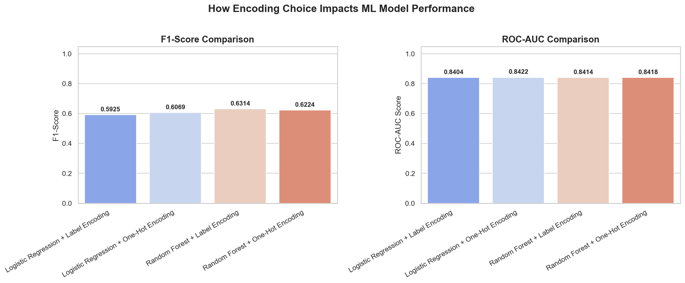

# Day 22 - Transforming Raw Categories into Machine Learning Signals

60 Days Data Science Challenge | Day 22  
Phase: Feature Engineering  

---

## What I Did Today

Today is Day 22, and I worked on **Feature Encoding**—the process of converting categorical text data into numerical features that ML algorithms can learn from. 

Using our IBM Telco Customer Churn dataset, I cleaned the variables, isolated the categorical features, applied both **Label Encoding** and **One-Hot Encoding**, and trained baseline **Logistic Regression** and **Random Forest** models to analyze how our encoding choices affect different model architectures.

---

## Dataset Structure: Before vs. After Encoding

Categorical features add representation complexity. Here is how our dataset changed structurally:

| Metric | Original (Cleaned) | Label Encoded | One-Hot Encoded |
| :--- | :---: | :---: | :---: |
| **Rows** | 7,043 | 7,043 | 7,043 |
| **Columns** | 20 | 20 | 31 |
| **Memory Usage** | 6,784.21 KB | 1,100.59 KB | 1,705.85 KB |
| **Sparsity (% of Zeros)** | N/A (Categorical Text) | 38.50% | 61.05% |

### Key Structural Insights:
1. **Memory Efficiency**: Label Encoding reduced the memory footprint by **83.7%** (from ~6.78 MB to 1.10 MB) because it replaced heavy Python string objects with primitive integers.
2. **Column Expansion**: One-Hot Encoding (with `drop_first=True` to prevent multi-collinearity) increased our columns from 20 to 31. This expansion is due to multi-class variables (like `PaymentMethod` with 4 classes expanding into 3 binary columns).
3. **Sparsity Jump**: OHE increased the dataset's sparsity to **61.05%** (meaning 61% of our cell values are now zero), creating a much wider, sparse matrix.

---

## Model Performance Report

I split both encoded versions of the dataset using an **80/20 stratified split** and scaled the numerical features (`tenure`, `MonthlyCharges`, `TotalCharges`). Then, I trained a linear model (**Logistic Regression**) and an ensemble tree model (**Random Forest** with balanced class weights) to compare their metrics:

| Model | Encoding Method | Accuracy | Precision | Recall | F1-Score | ROC-AUC |
| :--- | :---: | :---: | :---: | :---: | :---: | :---: |
| **Logistic Regression** | Label Encoding | 79.99% | 64.47% | 54.81% | 0.5925 | 0.8404 |
| **Logistic Regression** | One-Hot Encoding | **80.70%** | **66.04%** | **56.15%** | **0.6069** | **0.8422** |
| **Random Forest** | Label Encoding | **75.30%** | **52.28%** | 79.68% | **0.6314** | 0.8414 |
| **Random Forest** | One-Hot Encoding | 74.17% | 50.85% | **80.21%** | 0.6224 | **0.8418** |

### Performance Visualization

Here is the bar plot comparing F1-score and ROC-AUC for all 4 configurations:

---

## Critical Machine Learning Analysis

The results highlight a fundamental ML concept: **model architectures dictate feature representation choices.**

### 1. Why Logistic Regression Suffered Under Label Encoding
Logistic Regression is a linear classifier that computes:
$$y = \sigma(w_1 x_1 + w_2 x_2 + ... + b)$$
It assumes that the numerical scale of a feature directly correlates with the target probability. 
In Label Encoding, we mapped `PaymentMethod` to arbitrary integers:
- `Bank transfer (automatic)` $\rightarrow$ 0
- `Credit card (automatic)` $\rightarrow$ 1
- `Electronic check` $\rightarrow$ 2
- `Mailed check` $\rightarrow$ 3

This forced the model to assume that `Mailed check` has three times the "weight" of `Credit card`, which is completely arbitrary and wrong.
By moving to **One-Hot Encoding**, we split the classes into orthogonal binary columns (0 or 1). The optimizer could then calculate an independent coefficient (weight) for each category, boosting the F1-Score from **0.5925** to **0.6069**.

### 2. Why Random Forest Handled Label Encoding Perfectly
Random Forest builds ensembles of decision trees. Decision trees partition space using split points ($x_i \leq 1.5$). 
For a label-encoded feature, a tree can split on $x_i \leq 1$ vs $x_i > 1$, which acts as a group selector. It doesn't care that the scale is non-linear or arbitrary—it just cares about finding boundaries that separate classes.
Interestingly, Random Forest on Label Encoding scored a slightly higher F1-score (**0.6314**) than OHE (**0.6224**). When we one-hot encode, the tree must split across multiple sparse binary columns, which dilutes feature importance and forces deeper, less efficient trees. Keeping features grouped in a single column via Label Encoding allowed the trees to make cleaner, higher-level splits on this dataset.

---

## LinkedIn Reflection

Here is my natural learning reflection for LinkedIn:

---

Day 22 of my 60-Day Data Science challenge! Today, I tackled the mechanics of **Feature Encoding** — transforming categorical variables into machine learning signals.

I used the Telco Customer Churn dataset to test **Label Encoding** vs. **One-Hot Encoding (OHE)** head-to-head on two very different algorithms: Logistic Regression (linear) and Random Forest (tree-based).

Here is what I learned from the numbers:

📊 **1. The Structural Shift:**
Label encoding is highly space-efficient, dropping memory footprint by 83% by replacing string objects with primitive integers. OHE, on the other hand, expanded my dataset from 20 to 31 columns (using drop_first=True to avoid the dummy variable trap) and pushed sparsity to 61%.

⚙️ **2. Linear Models Hate Arbitrary Ordering:**
Logistic Regression performed significantly better on One-Hot encoded data (F1: 0.606 vs. 0.592). When I label-encoded features like PaymentMethod to numbers (0, 1, 2, 3), the linear optimizer treated it as a continuous scale, assuming a "Mailed check (3)" is three times larger than a "Credit card (1)". OHE solved this by creating orthogonal columns, giving each class its own independent coefficient.

🌳 **3. Trees Don't Care About Ordinal Traps:**
Random Forest performed incredibly well on Label Encoded data, actually securing a slightly better F1-score (0.631 vs. 0.622). Since decision trees split features by thresholding (e.g., <= 1.5 vs. > 1.5), they can easily isolate category integers. In fact, one-hot encoding categorical variables with multiple classes can dilute the trees' feature search space, making OHE less optimal for tree-based architectures.

Takeaway: There is no single "best" encoding. One-hot encode for linear and distance-based models; label encode (or use target encoding/native categories) for tree-based models.

On to Day 23!

#DataScience #MachineLearning #Python #ScikitLearn #FeatureEngineering #60DayChallenge #ABtalksDS

---

## Files Created
- [build_notebook.py](build_notebook.py) - Automates notebook generation.
- [day22_feature_encoding.ipynb](day22_feature_encoding.ipynb) - Completed and executed Jupyter Notebook.
- [encoding_comparison.png](encoding_comparison.png) - Performance visualization comparing models.
- [telco_churn_label_encoded.csv](telco_churn_label_encoded.csv) - Label Encoded dataset.
- [telco_churn_onehot_encoded.csv](telco_churn_onehot_encoded.csv) - One-Hot Encoded dataset.
- [README.md](README.md) - This report.
