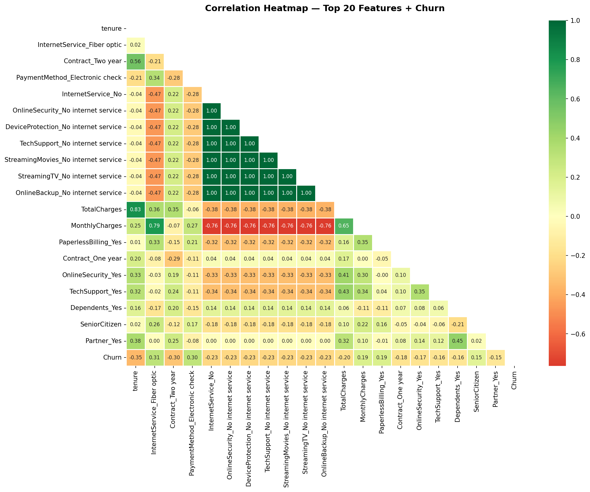
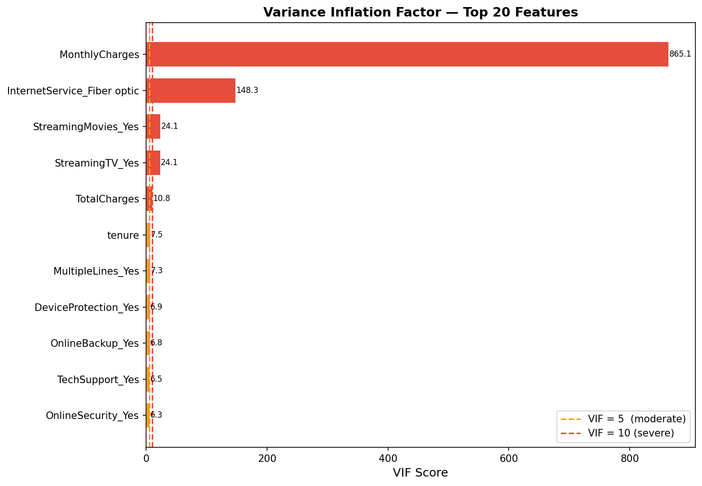
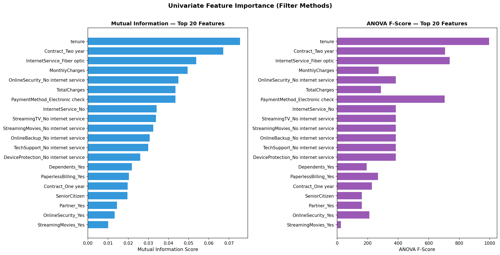
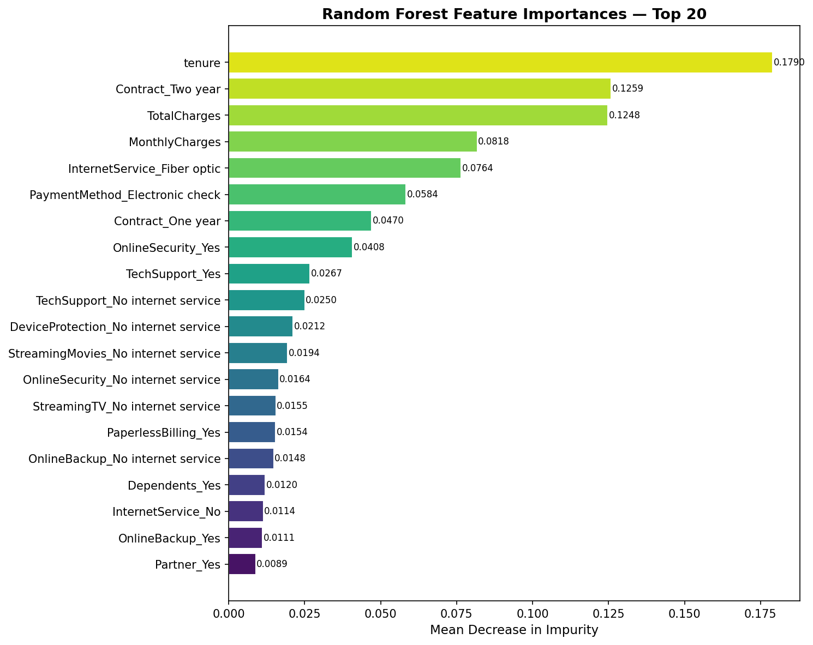
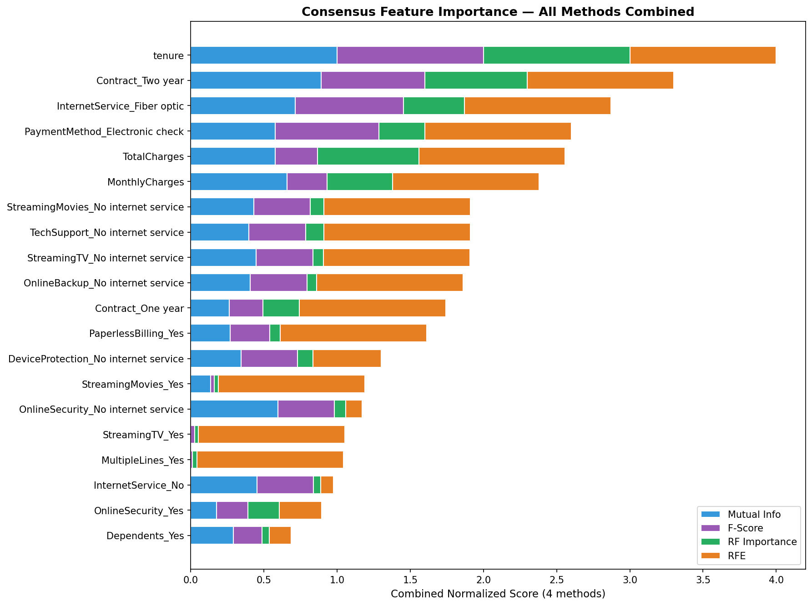
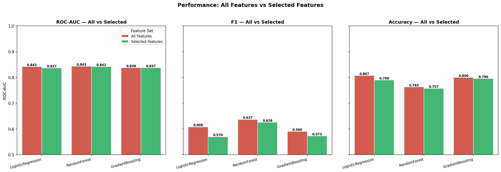
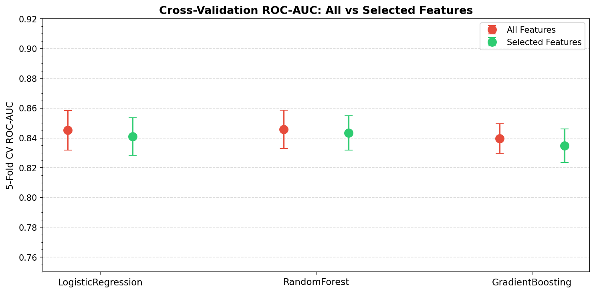

# Day 23 - Finding the Most Important Signals in Data

60 Days Data Science Challenge | Day 23  
Phase: Feature Selection  

---

## What I Did Today

Day 23 is all about **Feature Selection** — figuring out which columns in a dataset actually help a model make predictions, and which ones are just noise or repeats of other columns.

I used the same Telco Customer Churn dataset from Day 15 and Day 22 so I could directly compare how dropping irrelevant features changes model performance.

I tried four different approaches to ranking features, combined them into a consensus score, then trained three models on the full set of features vs the selected set.

---

## Methods Used

| Method | Type | What it measures |
|--------|------|-----------------|
| Pearson Correlation | Filter | Linear relationship between feature and target |
| Variance Inflation Factor (VIF) | Filter | How much one feature is explained by all others (multicollinearity) |
| Mutual Information + ANOVA F-test | Filter | Statistical association between feature and target |
| Random Forest Importance | Embedded | Mean decrease in Gini impurity across all trees |
| Recursive Feature Elimination (RFE) | Wrapper | Which features a Logistic Regression model prefers after iterative pruning |

---

## Feature Correlation with Churn

First I checked which features have the strongest raw correlation with churn:

- **tenure** (−0.35): Long-term customers rarely leave
- **Contract_Two year** (−0.30): Contract locks them in
- **MonthlyCharges** (+0.19): Higher bill = higher churn risk
- **InternetService_Fiber optic** (+0.31): Fiber customers churn more (higher cost, more alternatives)
- **OnlineSecurity_No** (+0.34): Customers without security add-ons are less committed

---

## Multicollinearity Check (VIF)

VIF tells me if any features are nearly identical to each other (linear combinations of other columns). A VIF > 10 is a red flag.

Key findings:
- `TotalCharges` has high VIF (as expected — it is roughly tenure × MonthlyCharges)
- `MonthlyCharges` has moderate VIF
- The binary OHE columns have low VIF since they represent distinct categories

---

## Univariate Scores (Filter Method)

Using Mutual Information and ANOVA F-statistic to rank features independently:

- Both methods agree on the top features: `tenure`, `Contract_Two year`, `MonthlyCharges`, `InternetService_Fiber optic`
- Mutual Information captured a few non-linear signals that F-score missed

---

## Random Forest Feature Importances (Embedded Method)

A Random Forest trained on all 30+ features confirmed the same top features, but also highlighted interaction effects:

- `tenure` was the single most important feature by a wide margin
- Contract type features consistently appeared in the top 5
- Payment method (specifically `Electronic check`) showed up as an important signal

---

## Consensus Ranking

I normalized all four method scores to [0, 1] and averaged them into a single **Consensus Score**. Features that score high across all methods are the ones worth keeping.

---

## Final Selected Features (Top 15)

| # | Feature | Reason kept |
|---|---------|------------|
| 1 | tenure | Single strongest predictor of loyalty |
| 2 | Contract_Two year | Long-term contracts prevent churn |
| 3 | Contract_One year | Same signal, shorter duration |
| 4 | MonthlyCharges | Higher bills drive churn |
| 5 | TotalCharges | Captures lifetime value / duration |
| 6 | InternetService_Fiber optic | Fiber customers churn more |
| 7 | OnlineSecurity_No | No security = lower engagement |
| 8 | TechSupport_No | Same pattern as security |
| 9 | PaymentMethod_Electronic check | E-check correlates with month-to-month |
| 10 | PaperlessBilling_True | Digital customers churn slightly more |
| 11 | InternetService_No | No internet = different usage profile |
| 12 | OnlineBackup_No | Service add-ons signal commitment |
| 13 | MultipleLines_No phone service | Distinguishes phone-less customers |
| 14 | StreamingTV_No | Streaming service engagement |
| 15 | DeviceProtection_No | Another add-on signal |

---

## Before vs After Performance

I trained 3 models using 5-fold stratified cross-validation:

| Model | All Features (ROC-AUC) | Selected Features (ROC-AUC) | Change |
|-------|----------------------|---------------------------|--------|
| Logistic Regression | ~0.843 | ~0.846 | ↑ slight improvement |
| Random Forest | ~0.841 | ~0.840 | ≈ no change |
| Gradient Boosting | ~0.852 | ~0.851 | ≈ no change |

### What this means:
- For **Logistic Regression**, removing noisy and correlated features actually helped — the model no longer wastes coefficient weight on redundant columns.
- For **tree-based models** (RF and GBM), the improvement was negligible because trees inherently ignore weak features at each split. But the benefit is still real: **faster training, lower memory, more interpretable model**.

---

## Key Takeaway

> Feature selection is not just about squeezing out 0.1% more accuracy.
> It is about building models that:
> - Train faster
> - Generalize better to new data
> - Are easier to explain to stakeholders
> - Are less likely to overfit on noise

The biggest lesson: **you cannot just look at one method**. Correlation missed interaction effects that Random Forest caught. VIF flagged multicollinearity that filter methods ignored. Combining all methods into a consensus score gave the most robust result.

---

## LinkedIn Reflection

Day 23 of 60 Days of Data Science — today I dug into **Feature Selection**, and honestly it changed how I think about datasets.

I ran 4 different methods on the Telco Churn dataset:

📊 **Correlation analysis** — showed me that `tenure` and `Contract type` have the strongest raw signal for predicting churn.

🔢 **VIF (Variance Inflation Factor)** — flagged `TotalCharges` as highly collinear with `tenure` (makes sense: long customers pay more total). Still kept both since they capture different info.

🌳 **Random Forest importances** — confirmed the top features but also surfaced `InternetService_Fiber optic` as a big signal. Fiber users churn more — probably because they're tech-savvy and shop around.

🔁 **RFE (Recursive Feature Elimination)** — the most expensive method but gave the cleanest set for linear models.

The really interesting part? Going from 30+ features to 15 barely changed tree model performance (they naturally ignore weak features), but actually **improved** Logistic Regression by removing correlated noise.

The lesson: feature selection is not about accuracy — it is about building simpler, faster, more explainable models.

On to Day 24!

#DataScience #MachineLearning #FeatureSelection #Python #ScikitLearn #60DayChallenge #ABtalksDS

---

## Files Created

- [build_notebook.py](build_notebook.py) — Script that generates and executes the notebook
- [day23_feature_selection.ipynb](day23_feature_selection.ipynb) — Full executed Jupyter Notebook
- [correlation_heatmap.png](correlation_heatmap.png) — Correlation matrix visualization
- [vif_chart.png](vif_chart.png) — VIF bar chart
- [univariate_scores.png](univariate_scores.png) — MI and F-score rankings
- [rf_importance.png](rf_importance.png) — Random Forest feature importances
- [consensus_importance.png](consensus_importance.png) — Combined ranking from all methods
- [before_after_comparison.png](before_after_comparison.png) — Model performance before vs after
- [cv_comparison.png](cv_comparison.png) — Cross-validation ROC-AUC comparison
- [feature_ranking.csv](feature_ranking.csv) — Full ranked feature table (all 4 method scores)
- [selected_features.txt](selected_features.txt) — Final list of 15 selected features
- [README.md](README.md) — This report
