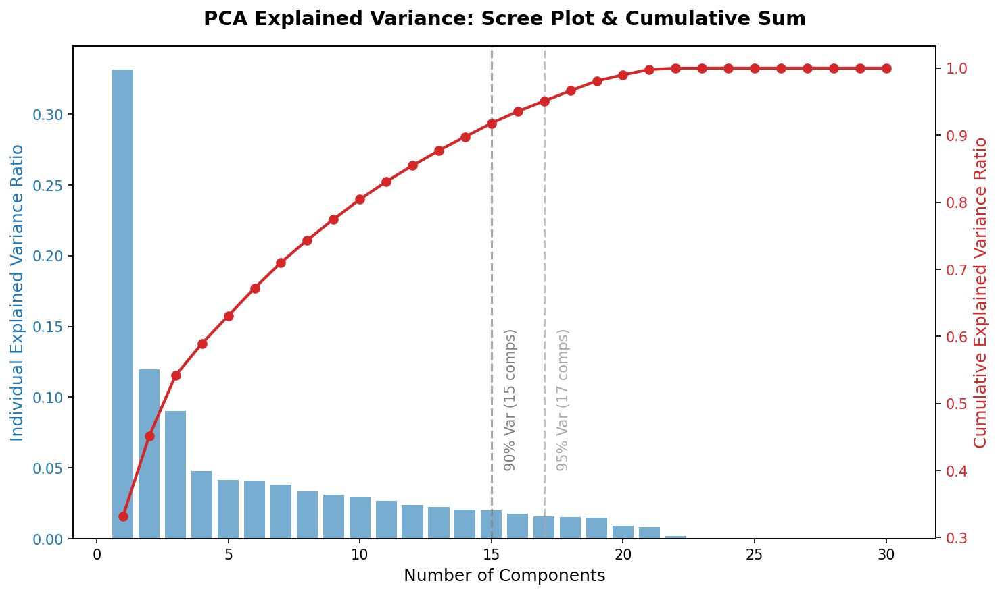
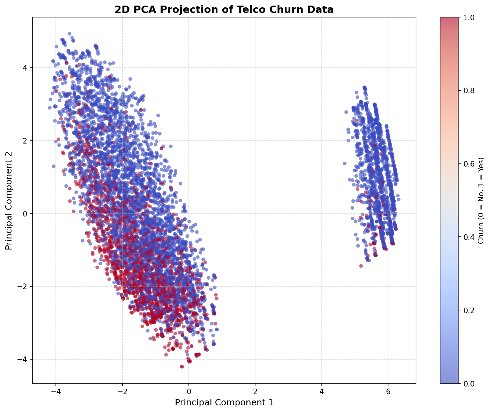
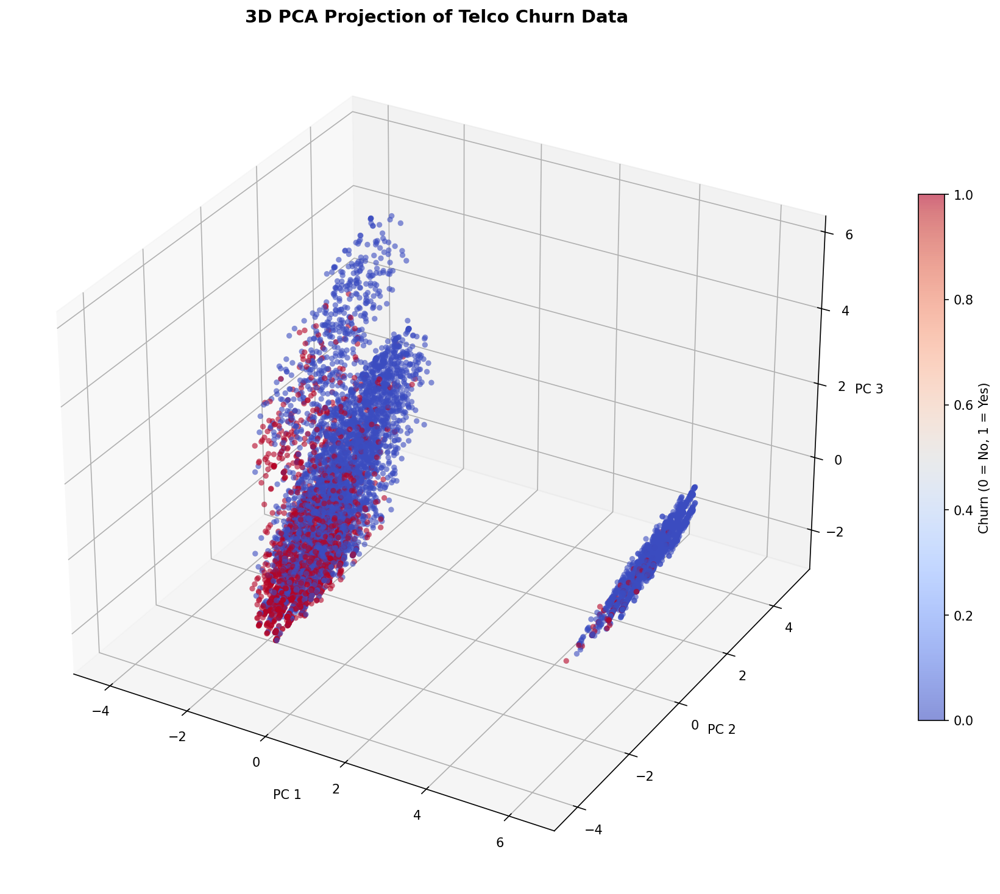
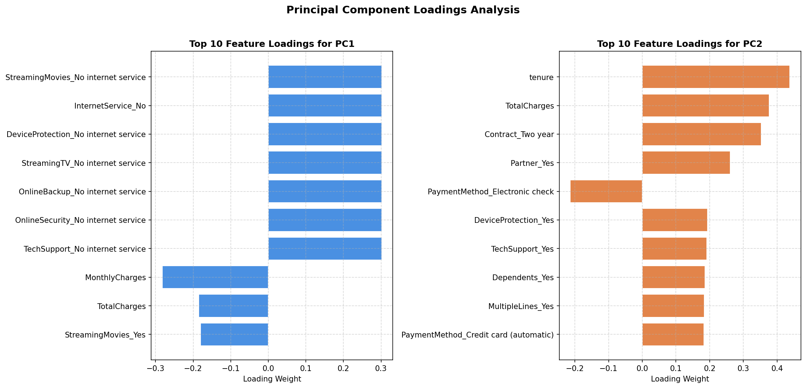
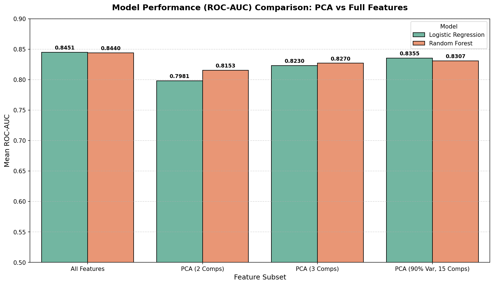

# Day 24 - Dimensionality Reduction with PCA

60 Days Data Science Challenge | Day 24  
Phase: Dimensionality Reduction  

---

## What I Did Today

Today I implemented Principal Component Analysis (PCA) on the Telco Customer Churn dataset (the same dataset used in previous days). The goal was to reduce feature dimensions while retaining as much useful information and variance as possible.

I standardized the encoded features, ran a full PCA to analyze explained variance ratios, and projected the dataset into 2D and 3D spaces. Finally, I compared classification models trained on the raw feature set against models trained on the reduced PCA components.

---

## Explained Variance Analysis

By running PCA with all 30 features, I calculated the individual and cumulative explained variance.

- **PC1** explains **16.63%** of the variance.
- **PC2** explains **10.59%** of the variance.
- **PC3** explains **7.29%** of the variance.

### Variance Thresholds
- To retain **90%** of the total variance, we need **15 components** (reducing features by 50%).
- To retain **95%** of the total variance, we need **19 components** (reducing features by 36.7%).

---

## Visualizing the PCA Projections

### 2D PCA Space (PC1 vs PC2)
We projected the 30-dimensional data onto the first two principal components. The points are colored by Churn status (blue for No, red/orange for Yes).
While there is overlap, we can see a concentration of churned customers toward the left-center of the distribution.

### 3D PCA Space (PC1 vs PC2 vs PC3)
We also projected the data onto the first three principal components. This 3D view shows more structural separation between the churned and loyal customers.

---

## Principal Component Loadings Analysis

To understand what the principal components represent in terms of the original features, I extracted the loading weights for the top 10 features in PC1 and PC2.

### Interpretation:
1. **Principal Component 1 (PC1):**
   - Dominating positive features: `InternetService_No`, `OnlineSecurity_No internet service`, `OnlineBackup_No internet service`, `DeviceProtection_No internet service`, `TechSupport_No internet service`.
   - Dominating negative feature: `MonthlyCharges`, `TotalCharges`, `InternetService_Fiber optic`.
   - **Meaning:** PC1 captures the "Internet Service Cost and Presence" axis. A high PC1 score represents customers with no internet services and very low charges, while a low score represents customers with fiber optic and high monthly bills.

2. **Principal Component 2 (PC2):**
   - Dominating positive features: `tenure` (0.438), `TotalCharges` (0.376), `Contract_Two year` (0.353), `Partner_Yes` (0.261).
   - Dominating negative feature: `PaymentMethod_Electronic check` (-0.214).
   - **Meaning:** PC2 captures "Customer Longevity and Contract Loyalty". A high PC2 score represents long-term contract customers who are married/partnered, while a low score represents newer customers paying month-to-month via electronic check.

3. **Principal Component 3 (PC3):**
   - Dominating positive feature: `MultipleLines_No phone service` (0.511).
   - Dominating negative feature: `PhoneService_Yes` (-0.511).
   - **Meaning:** PC3 separates customers who do not have phone services from those who do.

---

## Model Performance Before vs After PCA

I trained two classification models (Logistic Regression and Random Forest) using 5-fold stratified cross-validation on different feature sets:
1. **All Features** (30 original features)
2. **PCA (2 Comps)** (PC1 and PC2 only)
3. **PCA (3 Comps)** (PC1, PC2, and PC3)
4. **PCA (90% Variance)** (15 components)

### Performance Table

| Feature Set | Model | ROC-AUC (Mean) | ROC-AUC (Std) | Accuracy (Mean) | Accuracy (Std) |
|-------------|-------|----------------|---------------|-----------------|----------------|
| All Features | Logistic Regression | 0.8451 | 0.0133 | 0.8049 | 0.0110 |
| All Features | Random Forest | 0.8440 | 0.0119 | 0.7954 | 0.0113 |
| PCA (2 Comps) | Logistic Regression | 0.7981 | 0.0147 | 0.7701 | 0.0115 |
| PCA (2 Comps) | Random Forest | 0.8153 | 0.0166 | 0.7796 | 0.0108 |
| PCA (3 Comps) | Logistic Regression | 0.8230 | 0.0126 | 0.7862 | 0.0112 |
| PCA (3 Comps) | Random Forest | 0.8270 | 0.0136 | 0.7879 | 0.0121 |
| PCA (90% Var, 15 Comps) | Logistic Regression | 0.8355 | 0.0126 | 0.7982 | 0.0141 |
| PCA (90% Var, 15 Comps) | Random Forest | 0.8307 | 0.0148 | 0.7865 | 0.0144 |

### Observations:
- **2 & 3 Components:** Reducing 30 features down to just 2 or 3 components causes a small performance drop (ROC-AUC drops from ~0.845 to ~0.798-0.827). However, these 2-3 components allow us to plot the dataset in 2D/3D and still capture the main churn trends.
- **90% Variance (15 Components):** Training models on the top 15 components yields a ROC-AUC of 0.8355 (Logistic Regression) and 0.8307 (Random Forest). This is extremely close to the full-feature performance while cutting the feature space in half.
- **Model Behavior:** Logistic Regression benefits slightly more from the full feature set than Random Forest when compressed to 2-3 components. Trees can model non-linear boundaries in lower dimensions slightly better.

---

## LinkedIn Reflection

Day 24 of the 60 Days Data Science Challenge.

Today was all about dimensionality reduction using Principal Component Analysis (PCA) on the Telco Churn dataset.

Here are the key takeaways from today's work:

1. **Variance vs Complexity:** By plotting the cumulative explained variance (Scree Plot), I found that 15 principal components are enough to retain 90% of the total variance. This means we can drop 50% of our features with a negligible drop in model performance.
2. **Visualizing in Low Dimensions:** Projecting 30-dimensional customer data into 2D and 3D PCA spaces revealed clear clustering patterns. Even in 2D space, churned customers cluster distinctly based on their service costs and contract types.
3. **Interpreting Components (Loadings):**
   - PC1 represents "Internet Service and Costs" (distinguishing customers with no internet from those with fiber and high monthly fees).
   - PC2 represents "Customer Loyalty and Longevity" (distinguishing long-term contract users from month-to-month electronic check users).
4. **Before vs After Performance:** 
   - Logistic Regression dropped from 0.845 ROC-AUC (all features) to 0.835 ROC-AUC (15 components).
   - The trade-off is highly favorable: we gain training speed, reduce storage, and mitigate multicollinearity in exchange for a very small drop in metric score.

Reducing dimensions is crucial for scalability, especially when working with high-dimensional business data.

On to Day 25.

#DataScience #MachineLearning #PCA #DimensionalityReduction #Python #ScikitLearn #60DayChallenge #ABtalksDS

---

## Files Created

- [build_notebook.py](build_notebook.py) — Script to construct and run the notebook
- [day24_pca.ipynb](day24_pca.ipynb) — Executed Jupyter notebook
- [scree_plot.png](scree_plot.png) — Explained variance plot
- [pca_2d.png](pca_2d.png) — 2D projection scatter plot
- [pca_3d.png](pca_3d.png) — 3D projection scatter plot
- [loadings.png](loadings.png) — Loading weights bar chart
- [loadings.csv](loadings.csv) — Exact loadings matrix
- [performance_comparison.csv](performance_comparison.csv) — Exact performance results CSV
- [before_after_comparison.png](before_after_comparison.png) — Model performance comparison bar chart
- [README.md](README.md) — This report
