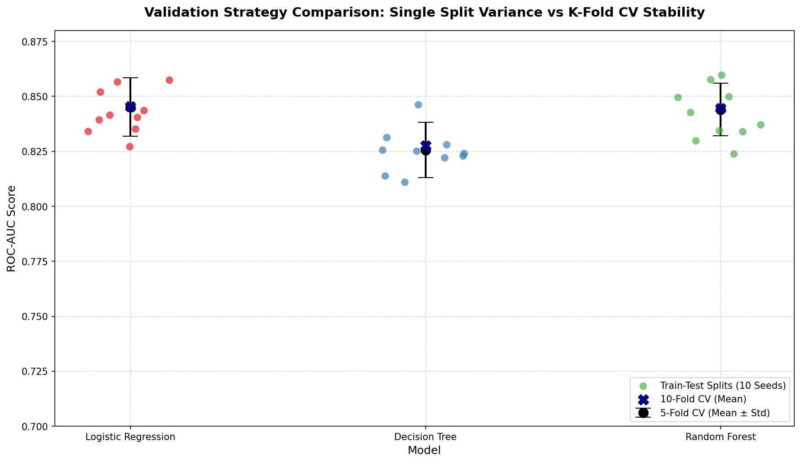

# Day 25 - Building Reliable Models with Cross-Validation

60 Days Data Science Challenge | Day 25  
Phase: Model Validation  

---

## What I Did Today

Today, I explored **Model Validation** techniques, specifically focusing on the difference between a single train-test split and K-Fold cross-validation. I wanted to see how much a model's performance score fluctuates just by changing the random split of the data, and how cross-validation helps us get a more stable, reliable estimate of how our model will perform in the real world on unseen data.

Using the **Telco Customer Churn dataset** (from Day 15), I:
1. Split the data into train and test sets using **10 different random seeds** (1 to 10) and trained three models (Logistic Regression, Decision Tree, and Random Forest) to observe the variance in test scores.
2. Ran **5-Fold and 10-Fold Stratified Cross-Validation** on the same models to calculate stable mean performance metrics and their standard deviations.
3. Visualized the comparison between the single-split variance and CV stability.
4. Analyzed model stability based on standard deviation of fold scores.

---

## Validation Strategy Comparison: Train-Test Split vs. K-Fold CV

When evaluating a model with a single train-test split, the score we get depends heavily on how the data was split. If we get a "lucky" split where the test set is easy to predict, the score is high. If we get an "unlucky" split, the score drops.

Here are the results of running **10 different random splits** compared to **5-Fold and 10-Fold Cross-Validation** (evaluating ROC-AUC score):

### Train-Test Split Score Distribution (10 Seeds)
| Model | Min ROC-AUC | Max ROC-AUC | Mean ROC-AUC | Split Std Dev | Range (Max - Min) |
| :--- | :---: | :---: | :---: | :---: | :---: |
| **Decision Tree** | 0.8110 | 0.8462 | 0.8250 | 0.0096 | 0.0352 |
| **Logistic Regression** | 0.8271 | 0.8574 | 0.8427 | 0.0099 | 0.0303 |
| **Random Forest** | 0.8238 | 0.8596 | 0.8418 | 0.0120 | 0.0358 |

### Cross-Validation Scores (5-Fold vs 10-Fold)
| Model | CV Folds | Mean ROC-AUC | CV Std Dev | Mean Accuracy | Mean F1-Score |
| :--- | :---: | :---: | :---: | :---: | :---: |
| **Logistic Regression** | 5-Fold | 0.8451 | 0.0133 | 0.8049 | 0.5997 |
| **Decision Tree** | 5-Fold | 0.8257 | 0.0125 | 0.7909 | 0.5671 |
| **Random Forest** | 5-Fold | 0.8440 | 0.0119 | 0.7954 | 0.5365 |
| **Logistic Regression** | 10-Fold | 0.8454 | 0.0176 | 0.8036 | 0.5952 |
| **Decision Tree** | 10-Fold | 0.8275 | 0.0162 | 0.7877 | 0.5434 |
| **Random Forest** | 10-Fold | 0.8446 | 0.0189 | 0.7972 | 0.5450 |

---

## Visualizing Validation Stability

This plot shows the individual ROC-AUC scores for each of the 10 train-test splits (scattered dots) compared to the 5-fold CV mean score (with standard deviation error bars) and 10-fold CV mean score (blue X):

### Key Observations:
1. **The Train-Test Split Lottery:** For Random Forest, a single split yielded a ROC-AUC as low as **0.8238** and as high as **0.8596**. If we relied on a single split, we might report an overly optimistic 86% ROC-AUC or a pessimistic 82% score, simply due to random chance!
2. **K-Fold CV Stability:** Both 5-fold and 10-fold CV give consistent mean scores (~0.845 for Logistic Regression, ~0.844 for Random Forest) that represent the true expected performance of the model on the overall dataset.
3. **5-Fold vs 10-Fold Variance:** While 10-fold CV uses more data for training in each fold, the standard deviation across individual folds is slightly higher (e.g. 0.0189 vs 0.0119 for Random Forest). This happens because each validation fold in 10-fold CV is smaller and more sensitive to individual sample variations, but the overall mean remains highly reliable.

---

## Model Stability Analysis

* **Most Reliable Model:** **Logistic Regression** achieved the highest overall mean ROC-AUC (~0.845) and accuracy (~0.804), while maintaining a very stable F1-score (~0.60).
* **Random Forest** performs closely behind with ~0.844 mean ROC-AUC. However, its F1-score is lower (~0.536-0.545) compared to Logistic Regression, showing it is slightly less robust at balancing precision and recall on this imbalanced dataset.
* **Decision Tree** has the lowest overall performance (~0.825 mean ROC-AUC) and exhibits higher variance on individual splits, showing that simple trees are more sensitive to how the data is partitioned.

---

## LinkedIn Reflection

Day 25 of the 60 Days Data Science Challenge! 🚀

Today was all about model validation and learning why we should NEVER trust a single train-test split! 🤖🔍

Here is what I discovered after testing Logistic Regression, Decision Trees, and Random Forests on the Telco Churn dataset:

1. **The Train-Test Split Lottery 🎟️:** I trained our models across 10 different random splits of the same dataset. For my Random Forest model, the ROC-AUC score fluctuated from a low of **0.824** to a high of **0.860**! If I only ran a single split, I could have ended up with an overly optimistic or pessimistic view of my model's capabilities purely by random chance.
2. **Cross-Validation to the Rescue 🛡️:** By implementing Stratified K-Fold Cross-Validation (5-fold and 10-fold), I calculated a robust, average representation of model performance. Logistic Regression emerged as the most reliable predictor with a stable mean ROC-AUC of **0.845** and F1-score of **0.60**.
3. **Understanding the Fold Variance 📊:** Interestingly, 10-fold CV had a slightly higher standard deviation across its folds compared to 5-fold CV. Why? Because with 10 folds, each validation split is smaller, making individual fold scores more sensitive to noise—even though the final averaged score is highly reliable.

**Takeaway:** If you want to deploy machine learning models with confidence, skip the single split and let cross-validation do the heavy lifting!

What's your go-to validation strategy? 5-fold, 10-fold, or nested cross-validation? Let know! 👇

#DataScience #MachineLearning #ModelValidation #CrossValidation #Python #ScikitLearn #60DayChallenge #ABtalksDS

---

## Files Created

* [day25_cross_validation.ipynb](day25_cross_validation.ipynb) — Executed Jupyter notebook with the full pipeline
* [cv_results.csv](cv_results.csv) — CSV file with detailed performance stats for 5-fold and 10-fold CV
* [cv_comparison.png](cv_comparison.png) — Matplotlib visualization comparing splits vs CV scores
* [README.md](README.md) — This report and documentation
