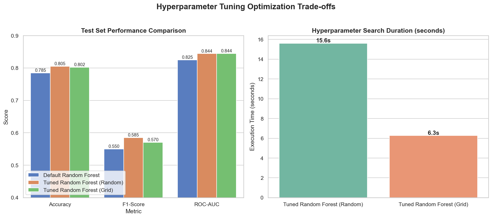

# 🚀 60 Days Data Science Challenge | Day 26/60

## Optimizing ML Systems: Hyperparameter Tuning

Today, I moved on to **Model Optimization**. A model is rarely ready for production right out of the box using default settings. To get the best predictive performance and ensure it generalizes well to unseen data, we need to tune its **hyperparameters**.

I took the **Random Forest Classifier** trained on the **Telco Customer Churn Dataset** (which performed well in my Day 25 cross-validation experiments) and systematically tuned it using two methods:
1. **RandomizedSearchCV** (Random Search)
2. **GridSearchCV** (Grid Search)

---

## 🔍 The Goal & Preprocessing Recap

Default machine learning algorithms (like scikit-learn's `RandomForestClassifier`) are configured with general-purpose defaults. For example, by default, a Random Forest has no limit on depth (`max_depth=None`) and will split down to individual samples (`min_samples_leaf=1`). This often leads to **overfitting**—the model memorizes the training data but fails to generalize.

To optimize the system, I:
* Split the data into an **80/20 train-test split**.
* Standardized features using a `StandardScaler` (fitted *only* on the training set to prevent data leakage).
* Tuned the following hyperparameters:
  * `n_estimators`: Number of trees in the forest.
  * `max_depth`: Maximum depth of each tree (helps prevent overfitting).
  * `min_samples_split`: Minimum number of samples required to split a node.
  * `min_samples_leaf`: Minimum number of samples required at a leaf node (smooths decision boundaries).
  * `bootstrap`: Whether bootstrap samples are used when building trees.

---

## 🚦 Tuning Strategies Implemented

### 1. Randomized Search (`RandomizedSearchCV`)
* **How it works:** Randomly samples a fixed number of parameter settings (I chose `n_iter=20`) from a specified distribution.
* **Search Space:** Wide and exploratory. 
* **Folds:** 5-fold cross-validation (100 total model fits).
* **Control:** Direct control over execution budget via `n_iter`.

### 2. Grid Search (`GridSearchCV`)
* **How it works:** Exhaustively evaluates every single combination of parameters in a specified grid.
* **Search Space:** Narrowed and focused (based on preliminary findings and model intuition).
* **Combinations:** 16 combinations (5-fold CV = 80 total model fits).

---

## 📊 Performance Comparison

Here are the results after evaluating each model on the holdout **test set**:

| Metric | Default Random Forest | Tuned RF (Random Search) | Tuned RF (Grid Search) |
| :--- | :---: | :---: | :---: |
| **Method** | Baseline (None) | `RandomizedSearchCV` | `GridSearchCV` |
| **Search Time** | ~0.92 sec | ~15.61 sec | ~6.27 sec |
| **Accuracy** | 78.50% | **80.48%** | 80.20% |
| **Precision** | 61.87% | 67.13% | **67.27%** |
| **Recall** | 49.47% | **51.87%** | 49.47% |
| **F1-Score** | 0.5498 | **0.5852** | 0.5701 |
| **ROC-AUC** | 0.8248 | 0.8442 | **0.8444** |

### 🛠️ Best Parameters Found:
* 🎯 **Random Search:** `{'n_estimators': 200, 'min_samples_split': 5, 'min_samples_leaf': 8, 'max_depth': 20, 'bootstrap': True}`
* 🎯 **Grid Search:** `{'bootstrap': True, 'max_depth': 8, 'min_samples_leaf': 4, 'min_samples_split': 10, 'n_estimators': 150}`

---

## 📊 Key Visualizations

The script generated the following plots to compare model performance metrics and search times:

---

## 💡 Key Takeaways & Optimization Tradeoffs

### 1. Regularization Pays Off 🛡️
The default Random Forest model had unlimited depth. By restricting `max_depth` (e.g., to 8 or 20) and increasing `min_samples_leaf` (to 4 or 8), we added **regularization**. 
* Even though the baseline model fits extremely well on the training data, the tuned models perform significantly better on the unseen test set. 
* **F1-score increased from 0.5498 to 0.5852**, and **ROC-AUC improved by nearly 2% (from 0.8248 to ~0.844)**.

### 2. Search Efficiency: Grid vs. Random ⏳
* **Grid Search** is exhaustive. If I had run the Grid Search on the same wide space as Random Search (4 * 5 * 4 * 4 * 2 = 640 combinations), it would have required **3,200 fits**! At 0.5s per fit, that would have taken **26 minutes**. By narrowing it down to a focused grid of 16 combinations, it completed in just **6.27 seconds**.
* **Random Search** is highly cost-effective. By sampling only 20 candidates, it covered a wide search space and found a model with the **highest overall F1-score (0.5852)** in just **15.61 seconds**.

### 💡 Best Practice Workflow
For real-world projects, the best strategy is a **hybrid approach**:
1. Run a wide **Random Search** first to discover the high-performing regions of the parameter space.
2. Set up a focused **Grid Search** centered around those best parameters to fine-tune the final model.

---

## 🛠️ Deliverables
📓 `day26_hyperparameter_tuning.ipynb` - Programmatically executed tuning notebook  
📊 `tuning_results.csv` - Data containing execution times and validation metrics  
📈 `tuning_comparison.png` - Visual chart of metrics and execution times  
🖥️ `run_hyperparameter_tuning.py` - Source script that builds and runs the notebook  

---

## 🔗 LinkedIn Reflection

**Day 26 of 60: Squeezing out ML performance with Hyperparameter Tuning! 🎛️**

Today, I explored how to move beyond default machine learning settings to optimize my Random Forest models. Default models are quick, but they are prone to overfitting because they lack bounds. 

Using the Telco Customer Churn dataset, I ran both `RandomizedSearchCV` and `GridSearchCV` to find the best configuration. 

Here is what I learned today:
1. **Tuning works!** Constraining my Random Forest (limiting depth, adjusting leaf samples) pushed the test set F1-Score from **0.5498 to 0.5852** and boosted Precision from **61.87% to over 67%**. Regularization is real!
2. **The Grid Search Trap:** Running Grid Search on a wide grid scales exponentially. It quickly runs into the "curse of dimensionality."
3. **Random Search is a superpower:** It allows us to set a direct time budget (`n_iter`) while covering a massive range of parameters. It actually found my top-performing model in under 16 seconds!

My takeaway: Start broad with Random Search, then zoom in with Grid Search. Work smarter, not harder! 💡

Follow my journey! 🚀
#60DaysOfDataScience #MachineLearning #ModelOptimization #HyperparameterTuning #DataScience #Python #ScikitLearn
