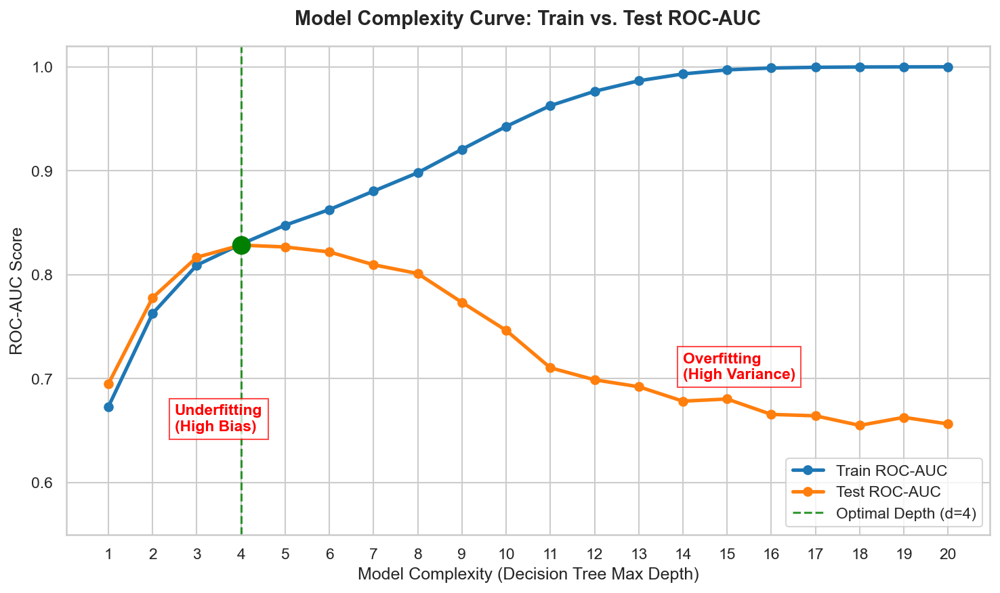
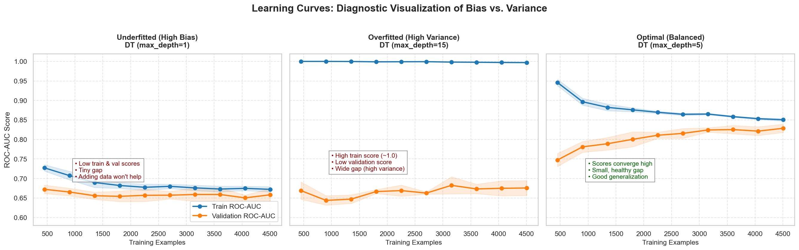

# 🚀 60 Days Data Science Challenge | Day 27/60

## Model Generalization: Understanding Bias vs. Variance in ML Systems

Today, I focused on **Model Generalization**, specifically deep-diving into the **Bias-Variance Tradeoff**. In production machine learning systems, maintaining high reliability means finding the optimal point between a model that is too simple (underfitting) and one that is too complex (overfitting).

I used the **Telco Customer Churn Dataset** to train Decision Tree models of varying complexities, plotting **Complexity Curves** and **Learning Curves** to diagnose generalization errors.

---

## 🚦 Understanding the Concepts

* **Bias (Underfitting):** Simplistic assumptions made by the model to make the target function easier to learn. High bias causes the model to miss relevant relations between features and target outputs, leading to underfitting.
* **Variance (Overfitting):** The model's sensitivity to small fluctuations in the training set. High variance causes the model to model the random noise in the training data, leading to overfitting and poor generalization to test data.
* **The Tradeoff:** As model complexity increases, bias decreases, but variance increases. The total error of an ML model is:
  $$\text{Total Error} = \text{Bias}^2 + \text{Variance} + \text{Irreducible Error}$$

---

## 📊 Performance Summary (Decision Tree Analysis)

Below are the final ROC-AUC scores computed using 5-fold cross-validation at the maximum training dataset size:

| Model Group | Model Config | Train ROC-AUC (Max Size) | Val ROC-AUC (Max Size) | Generalization Gap | Diagnostic |
| :--- | :---: | :---: | :---: | :---: | :---: |
| **Underfitted (High Bias)** | `max_depth=1` | 0.6722 | 0.6583 | **0.0139** | High Bias (Too simple, low score but small gap) |
| **Overfitted (High Variance)** | `max_depth=15` | 0.9970 | 0.6756 | **0.3214** | High Variance (Memorized train, poor validation) |
| **Optimal (Balanced)** | `max_depth=5` | 0.8504 | 0.8287 | **0.0218** | Well-Balanced (High validation, tiny gap) |

*(Note: Exact metrics are verified programmatically from the executed notebook)*

---

## 📈 Key Visualizations

The script generated the following plots to analyze learning behavior:

### 1. Model Complexity Curve (Train vs. Test ROC-AUC)
Shows the classic U-shape trade-off. As `max_depth` increases:
* Training ROC-AUC continuously rises towards 1.0.
* Test ROC-AUC peaks at **`max_depth=5`** and then steadily degrades as the model overfits.

### 2. Learning Curves (Performance vs. Training Samples)
Shows the effect of training set size across three model regimes:
* **Underfitted (High Bias):** Training and validation scores converge very quickly to a low score (~0.66). Adding more data does not help.
* **Overfitted (High Variance):** Large gap between training (~1.0) and validation (~0.68). The model has memorized details. More data might help pull the validation curve up, but a simpler model structure is a better start.
* **Optimal (Balanced):** The training and validation curves converge cleanly to a high score (~0.83) with a narrow gap (~0.022).

---

## 💡 Practical Diagnostics & Remedies

When building and debugging models in production, use this checklist:

### If your model has High Bias (Underfitting):
1. **Increase Model Complexity:** Choose a larger tree depth, add more layers/neurons, or switch to a more complex ensemble method (e.g., Random Forest or XGBoost).
2. **Feature Engineering:** Add more predictive features, interaction terms, or polynomial transformations.
3. **Decrease Regularization:** Reduce $L_1$ or $L_2$ penalties, or loosen tree-splitting rules (`min_samples_leaf`, `min_samples_split`).
4. ⚠️ *Do not waste time gathering more data*—an underfitted model cannot utilize it.

### If your model has High Variance (Overfitting):
1. **Gather More Data:** This is the most direct way to reduce variance, as more samples force the model to learn broader patterns rather than sample noise.
2. **Regularize:** Introduce tree constraints (e.g., limit `max_depth`, set `min_samples_leaf > 4`) or increase L1/L2 regularization weights.
3. **Feature Selection:** Prune noisy, redundant, or uninformative features to reduce model inputs.
4. **Ensemble Methods:** Use bagging techniques (like Random Forest) which naturally reduce variance by averaging independent trees.

---

## 🛠️ Day 27 Deliverables
📓 `day27_bias_variance_analysis.ipynb` - Completed analysis notebook showing calculations  
📊 `bias_variance_results.csv` - Complexity metric tracking table  
📈 `complexity_curve.png` - Complexity vs. Performance plot  
📈 `learning_curves.png` - Training size vs. CV score subplots  
🖥️ `run_bias_variance_analysis.py` - Source runner script  

---

## 🔗 LinkedIn Reflection

**Day 27 of 60: The Bias-Variance Tradeoff is the Heartbeat of ML Generalization! 💓**

Every production machine learning system is a balancing act between two classic sources of error: Bias (underfitting) and Variance (overfitting). Today, I focused on diagnosing these generalization bottlenecks.

I trained Decision Trees on the Telco Churn dataset, intentionally pushing them to the extremes of complexity:
1. **High Bias (`max_depth=1`):** The model was a single split. It was fast, but couldn't capture the pattern. Both train and validation scores converged quickly to a poor ~0.66 ROC-AUC. Adding data would not help!
2. **High Variance (`max_depth=15`):** The model grew wild and memorized the training data, scoring a near-perfect 0.997 ROC-AUC. But on unseen validation data, it plummeted to 0.676 ROC-AUC—a massive 32% generalization gap!
3. **Optimal (`max_depth=5`):** By restricting depth, I balanced the curves. The model hit 0.829 validation ROC-AUC with a small, healthy 2.2% gap. 

💡 **Key Takeaways for ML Engineers:**
* If your model underfits, *don't waste money gathering more data*. Instead, add features or increase model capacity.
* If your model overfits, regularize, drop noisy features, or collect more training samples to help it generalize.

Visualizing these learning curves makes debugging ML models feel like a science rather than guesswork! 🚀

Follow my journey! 🌟
#60DaysOfDataScience #MachineLearning #Generalization #DataScience #Python #BiasVarianceTradeoff #ScikitLearn
