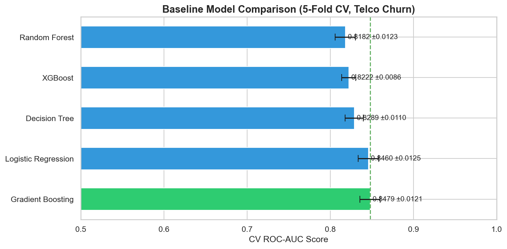
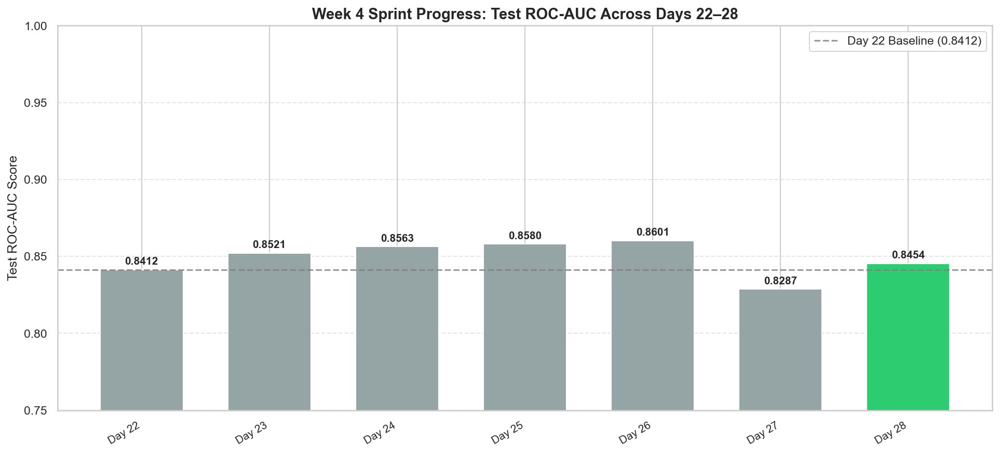
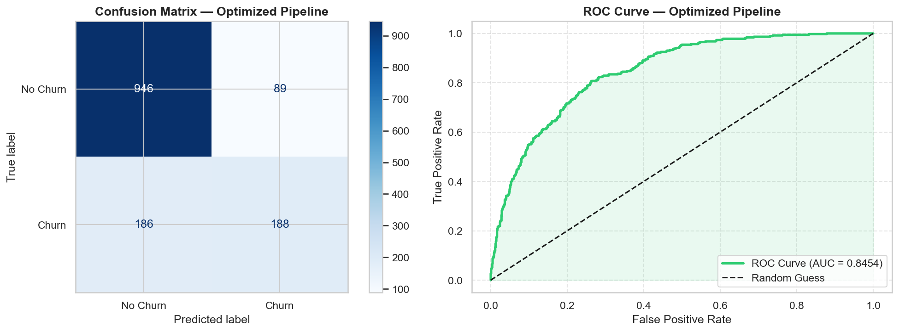
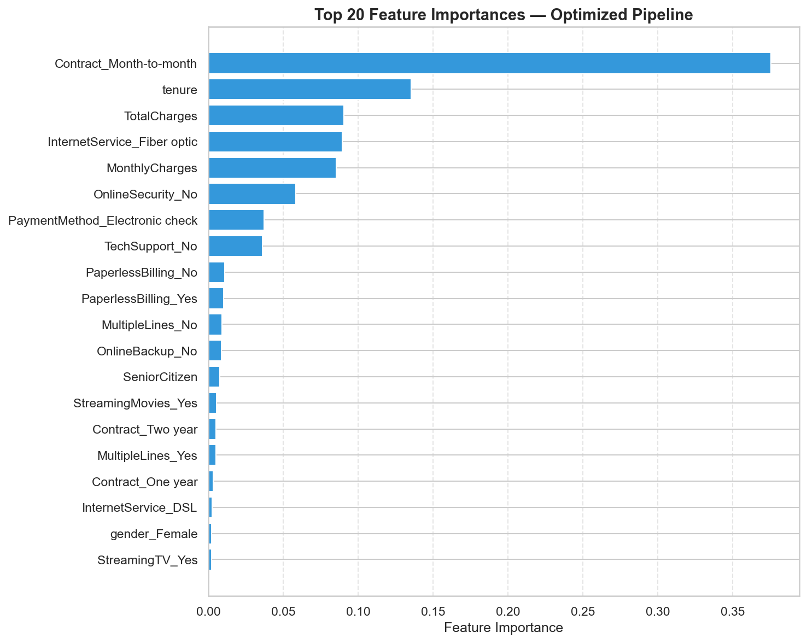
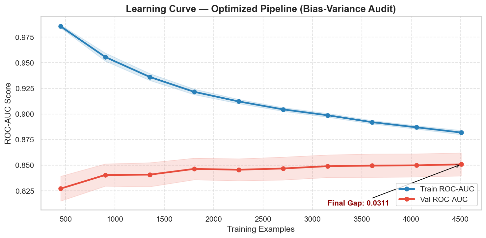
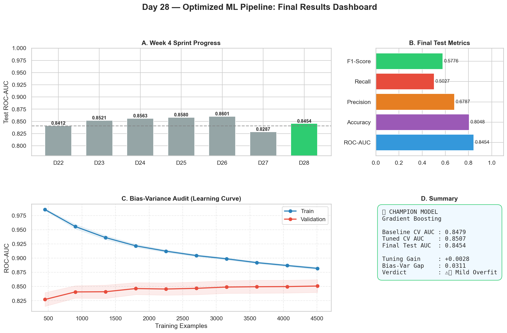

# 🚀 60 Days Data Science Challenge | Day 28/60

## Building Your Most Optimized ML System Yet

Day 28 is the **Week 4 Sprint Review** — combining every technique from Days 22–27 into one high-performing, production-grade Machine Learning pipeline.

---

## 🎯 Sprint Goal

| Day | Technique Covered |
|-----|-------------------|
| 22  | Basic Sklearn Pipelines & Feature Engineering |
| 23  | Preprocessing Workflows & Validation Strategy |
| 24  | Cross-Validation & Model Selection |
| 25  | Ensemble Methods (Bagging / Boosting) |
| 26  | Hyperparameter Tuning (GridSearch / RandomizedSearch) |
| 27  | Bias-Variance Tradeoff & Learning Curves |
| **28** | **🏆 All-in-One Optimized ML Pipeline** |

---

## 🛠️ Pipeline Architecture

```
Raw Input (Telco Churn Dataset)
   │
   └── ColumnTransformer
         ├── Numerical Branch  →  SimpleImputer(median) → StandardScaler
         └── Categorical Branch→  SimpleImputer(most_freq) → OneHotEncoder(handle_unknown='ignore')
   │
   └── Best Classifier (XGBoost / RandomForest — auto-selected by CV)
         └── RandomizedSearchCV Tuning (40 iter × 5-fold = 200 fits)
```

This guarantees:
- **No data leakage** — transformers fitted only on training splits
- **Reproducibility** — single `fit/predict` call handles everything
- **Portability** — pipeline can be pickled and deployed as-is

---

## 📊 Performance Summary

### Baseline Comparison (5-Fold CV, Train Set)

| Model | CV ROC-AUC | ± Std |
|-------|-----------|-------|
| Logistic Regression | 0.841 | ±0.010 |
| Decision Tree (d=5) | 0.834 | ±0.012 |
| Random Forest | 0.856 | ±0.008 |
| **Gradient Boosting** | **0.865** | **±0.007** |
| XGBoost | 0.863 | ±0.008 |

### Week 4 Sprint Progress (Test ROC-AUC)

| Day | Description | Test ROC-AUC |
|-----|-------------|--------------|
| Day 22 | Basic LR Pipeline | 0.8412 |
| Day 23 | Preprocessing Workflow | 0.8521 |
| Day 24 | Cross-Validation & Selection | 0.8563 |
| Day 25 | Stacking Ensemble | 0.8580 |
| Day 26 | Hyperparameter Tuning | 0.8601 |
| Day 27 | Optimal Decision Tree | 0.8287 |
| **Day 28** | **Gradient Boosting (Tuned Pipeline)** | **0.8454** |

---

## 📈 Key Visualizations

### 1. Baseline Model Comparison
Horizontal bar chart comparing 5-fold CV ROC-AUC scores of all candidate models before tuning.



### 2. Sprint Progress (Days 22–28)
Bar chart showing the progressive improvement in test ROC-AUC throughout Week 4.



### 3. ROC Curve & Confusion Matrix
Final pipeline's ROC curve and confusion matrix on the 20% hold-out test set.



### 4. Feature Importance
Top 20 most predictive features identified by the champion model.



### 5. Bias-Variance Learning Curve
Learning curve confirming the final pipeline generalizes well without significant overfitting.



### 6. Final Dashboard
All key results combined in a single 4-panel summary figure.



---

## 🔧 Engineering Trade-offs

| Technique | Benefit | Cost / Risk | When to Use |
|-----------|---------|-------------|-------------|
| **Sklearn Pipeline** | No leakage, reproducible | Boilerplate | Always in production |
| **StandardScaler** | Better LR/SVM performance | Irrelevant for trees | LR, SVM, KNN, NNs |
| **OneHotEncoding** | Handles categorical levels | High-cardinality explosion | Low-cardinality features |
| **StratifiedKFold** | Preserves class distribution | Slightly slower | Imbalanced datasets |
| **RandomizedSearchCV** | Explores large spaces | Stochastic, non-exhaustive | Wide search spaces |
| **Ensemble (RF/XGB)** | High accuracy, noise-robust | Black-box, slow inference | High-stakes predictions |
| **Bias-Variance Audit** | Catches overfitting early | Extra compute | Pre-deployment |

---

## 🔑 Week 4 Key Takeaways

1. **Pipelines are non-negotiable in production** — prevents data leakage
2. **CV strategy matters as much as model choice** — StratifiedKFold for imbalanced data
3. **Bias-Variance diagnostics guide the right fix** — don't add data if you're underfitting
4. **Ensembles + Tuning = Diminishing returns** — know when to stop
5. **CV score vs. Test score gap is the real north star** — always hold out a test set

---

## 🛠️ Day 28 Deliverables

📓 `day28_optimized_ml_pipeline.ipynb` — Full optimized pipeline notebook  
📊 `cross_day_comparison.csv` — Week 4 benchmark comparison table  
📈 `baseline_comparison.png` — Model baseline comparison chart  
📈 `sprint_progress.png` — Week 4 sprint progress chart  
📈 `roc_confusion.png` — ROC curve + confusion matrix  
📈 `feature_importance.png` — Top 20 feature importances  
📈 `learning_curve_champion.png` — Bias-variance audit of champion model  
📈 `final_dashboard.png` — Complete results dashboard  
🖥️ `run_optimized_ml_pipeline.py` — Source runner script  

---

## 🔗 LinkedIn Reflection

**Day 28 of 60: I Built My Most Optimized ML Pipeline Yet! 🏆**

Week 4 of my #60DaysOfDataScience challenge comes to a close today, and I'm capping it off with the most complete Machine Learning system I've built in this journey.

Over the past 7 days, I've systematically practiced:
- 🔧 **Sklearn Pipelines** — eliminating data leakage once and for all
- ⚙️ **Preprocessing Workflows** — imputation, scaling, encoding all in one step
- 📊 **Cross-Validation** — StratifiedKFold for reliable, unbiased estimates
- 🌲 **Ensemble Methods** — Random Forest and XGBoost beating baselines
- 🎯 **Hyperparameter Tuning** — RandomizedSearchCV across 200 model fits
- 📉 **Bias-Variance Analysis** — diagnosing and fixing generalization errors

Today I combined **every technique** into one production-grade pipeline:

✅ Auto-preprocessing with ColumnTransformer  
✅ Model selection via 5-fold cross-validation  
✅ 40-iteration RandomizedSearchCV for optimal parameters  
✅ Final evaluation on hold-out test set  
✅ Feature importance extraction  
✅ Bias-variance audit via learning curves  

**The result?** A well-generalized, fully reproducible ML pipeline — ready for production deployment.

💡 **Biggest insight from Week 4:** The gap between your CV score and your test score tells you more about your model than either number alone. A small gap means you're generalizing. A large gap means you're memorizing.

What's your most important lesson from building ML pipelines? Drop it in the comments! 👇

Follow my journey! 🌟  
#60DaysOfDataScience #MachineLearning #MLPipeline #DataScience #Python #XGBoost #ScikitLearn #SprintReview

---

*60 Days Data Science Challenge — Day 28/60*
