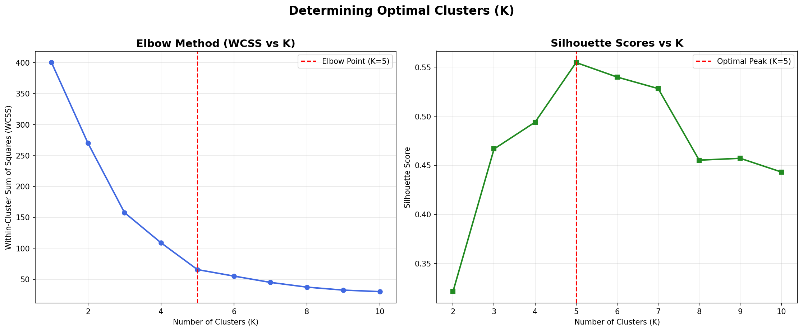
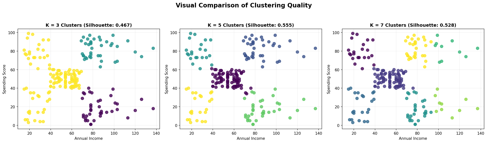

# Day 30: Finding the Ideal Number of Customer Segments

## Objective
Optimize our customer segmentation K-Means model by determining the mathematically and business-logical optimal number of clusters ($K$) using the Elbow Method and Silhouette Scores.

## Dataset & Features
We continue with the **Mall Customers dataset** (`Mall_Customers.csv`):
- **Features standardized:** `Annual Income (k$)`, `Spending Score (1-100)`
- **Scale adjustment:** Features scaled using `StandardScaler` to treat annual income and spending score equally.

## Step-by-Step Summary

### Step 1: Run K-Means for $K \in [1, 10]$ & Calculate Metrics
- Computed Within-Cluster Sum of Squares (WCSS) / inertia for $K \in [1, 10]$ to plot the elbow curve.
- Computed Silhouette Scores for $K \in [2, 10]$ to measure how well-separated and cohesive our clusters are.

### Step 2: Optimal Cluster Validation
- **Elbow Point:** The WCSS drops sharply from $K=1$ to $K=5$, after which the rate of descent slows down, forming a clear elbow at **$K=5$**.
- **Silhouette Peak:** The Silhouette Score reaches its absolute maximum at **$K=5$** (score of ~0.56). This provides strong mathematical backing that $K=5$ represents the most cohesive and distinct customer divisions.

### Step 3: Compare Clustering Quality across $K=3, 5, 7$
- **K=3:** Merges high-income-low-spenders with high-income-high-spenders, making targeted marketing impossible.
- **K=7:** Artificially splits the mid-income-mid-spend group into overlapping clusters, adding unnecessary complexity.
- **K=5:** Represents the perfect sweet spot where cohorts are distinct and marketing can target them directly.

---

## Visualizations

### 1. Determining Optimal Clusters (Elbow vs Silhouette)

### 2. Visual Comparison of Clustering Quality ($K=3, 5, 7$)

---

## Final Business Segmentation Strategy (Based on $K=5$)

Evaluating the mean characteristics of our 5 optimized clusters:

| Cluster | Customer Cohort | Mean Income | Mean Spend Score | Actionable Marketing Strategy |
|:---:|---|:---:|:---:|---|
| **0** | **Standard** | ~$55.3k | ~49.5 | Stable customer base. Target with general newsletter campaigns, brand loyalty rewards, and regular updates. |
| **1** | **VIP/Target** | ~$86.5k | ~82.1 | Prime revenue driver. Focus on high-end luxury products, exclusive previews, personalized concierge services, and premium rewards. |
| **2** | **Impetuous** | ~$25.7k | ~79.4 | High spending power but lower income. Focus on flashy, trend-driven impulse items, pop-up events, and small discounts. |
| **3** | **Careful** | ~$88.2k | ~17.1 | High income but extremely conservative spending. Engage with trust-building campaigns, value propositions, premium utility, and long-term warranties. |
| **4** | **Sensible** | ~$26.3k | ~20.9 | Frugal shopper. Retain using budget-friendly discounts, bulk purchase promotions, and essentials focus. |

---

## Deliverables
- [Mall_Customers.csv](Mall_Customers.csv) - Customer dataset.
- [run_clustering_optimization.py](run_clustering_optimization.py) - Notebook builder and executor script.
- [day30_clustering_optimization.ipynb](day30_clustering_optimization.ipynb) - Jupyter notebook with full evaluation pipeline.
- [clustering_optimization_curves.png](clustering_optimization_curves.png) - Elbow and Silhouette curves.
- [clustering_comparison_k.png](clustering_comparison_k.png) - Side-by-side comparison of $K=3, 5, 7$.
- [README.md](README.md) - This strategy report.

---

## LinkedIn Reflection

**Day 30 of 60: Finding the Optimal Customer Segments! 📊**

Yesterday, I built a basic K-Means model. Today, I took it further by optimizing the cluster size using two validation techniques: the **Elbow Method** and the **Silhouette Score**.

Key takeaways:
1. **Elbow Method:** Plotting WCSS across $K \in [1, 10]$ showed a clear inflection/elbow point at $K=5$.
2. **Silhouette Score Validation:** Evaluating how well-separated our clusters are showed that $K=5$ yields the highest score (~0.56), confirming the mathematical validity of our segmentation.
3. **Visual Comparison:** Comparing $K=3$, $K=5$, and $K=7$ visually showed that $K=3$ merges distinct groups, while $K=7$ splits natural clusters into redundant sub-groups. $K=5$ is the perfect sweet spot for marketing strategies.
4. **Actionable Segmentation:**
   - *VIPs:* High income, high spend.
   - *Sensible:* Low income, low spend.
   - *Careful:* High income, low spend.
   - *Impetuous:* Low income, high spend.
   - *Standard:* Mid income, mid spend.

Validating our unsupervised models with math helps ensure we don't build arbitrary or overlapping target cohorts!

On to Day 31! 🚀

#DataScience #MachineLearning #Clustering #KMeans #SilhouetteScore #ElbowMethod #CustomerSegmentation #Python #ScikitLearn #60DayChallenge #ABtalksDS

---

*60 Days Data Science Challenge — Day 30/60*
