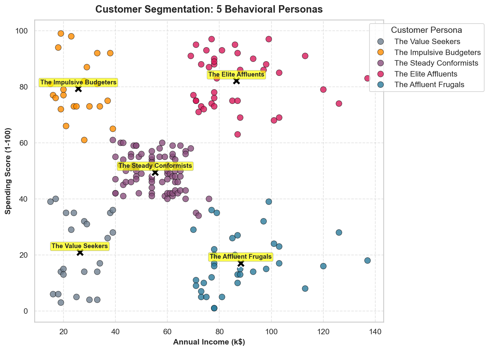
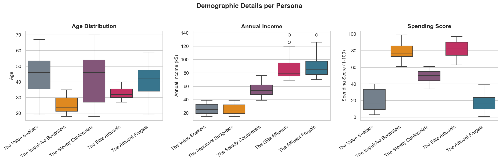
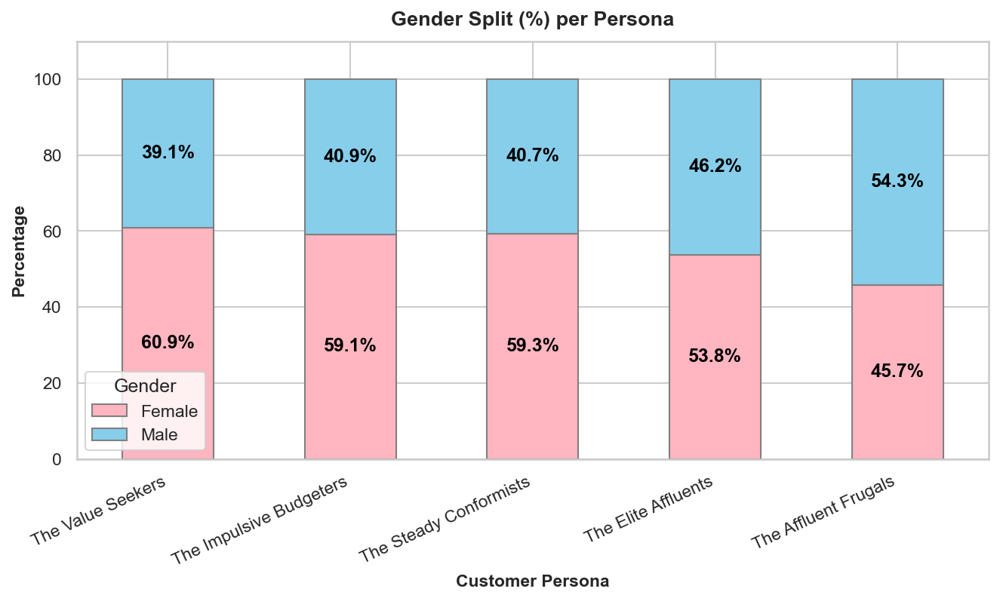

# Day 31: Building Customer Personas from Behavioral Data

Today I took the 5 customer clusters from yesterday's K-Means model and converted them into real-world business personas. Math gives us clusters, but to actually use them in business, we need to understand who these people are. By looking at age and gender splits alongside income and spending scores, I profiled each group and came up with some marketing strategies for them.

## Customer Persona Summary Table

Here is the quick stats breakdown of the 5 personas I found:

| Persona Name | Behavioral Profile | Customer Count | % of Base | Avg Age | Gender Ratio | Avg Income | Avg Spend Score |
| :--- | :--- | :---: | :---: | :---: | :---: | :---: | :---: |
| **The Elite Affluents** | High Income, High Spend | 39 | 19.5% | 32.7 | 53.8% F / 46.2% M | $86.5k | 82.1 |
| **The Affluent Frugals** | High Income, Low Spend | 35 | 17.5% | 41.1 | 48.6% F / 51.4% M | $88.2k | 17.1 |
| **The Steady Conformists** | Mid Income, Mid Spend | 81 | 40.5% | 42.7 | 59.3% F / 40.7% M | $55.3k | 49.5 |
| **The Impulsive Budgeters** | Low Income, High Spend | 22 | 11.0% | 25.3 | 59.1% F / 40.9% M | $25.7k | 79.4 |
| **The Value Seekers** | Low Income, Low Spend | 23 | 11.5% | 45.2 | 60.9% F / 39.1% M | $26.3k | 20.9 |

## Visualizing our Personas

### 1. Income vs Spend Score Scatter Plot
This plot shows our 5 personas. The black 'X' marks are the centroids for each group:

### 2. Demographic Distributions
These boxplots show how Age, Income, and Spending Score are distributed across the personas. You can see that "The Impulsive Budgeters" are our youngest group (average age 25), while "The Value Seekers" and "The Steady Conformists" lean older (around 43-45):

### 3. Gender Split
This stacked bar chart shows the gender split for each group. Females make up the biggest portion of "The Value Seekers" (60.9%), while males represent a slight majority in "The Affluent Frugals" (51.4%):

## Actionable Business Strategies

- **The Elite Affluents:** Target with a VIP loyalty program, high-end luxury offers, and private pre-launch shopping events.
- **The Affluent Frugals:** Focus on product specifications, warranties, long-term utility, and logical "investment" marketing.
- **The Steady Conformists:** Reward consistency using simple points loyalty programs and monthly newsletters.
- **The Impulsive Budgeters:** Target on social media (TikTok/Instagram) with fast-fashion trends, flash sales, and Buy Now, Pay Later (BNPL) checkout options.
- **The Value Seekers:** Promote clearance items, bulk-buy discounts, and BOGO deals using low-cost SMS alerts.

## Repository Files for Day 31
- [day31_persona_analysis.ipynb](day31_persona_analysis.ipynb) - Jupyter Notebook with the analysis code.
- [customer_persona_report.md](customer_persona_report.md) - Detailed business report explaining my findings and recommendations.
- [run_persona_analysis.py](run_persona_analysis.py) - Script that builds and executes the notebook.
- [customer_personas_summary.csv](customer_personas_summary.csv) - CSV summary of persona stats.
- [Mall_Customers_Labeled_Personas.csv](Mall_Customers_Labeled_Personas.csv) - Labeled dataset with assigned personas.

## LinkedIn Reflection

**Day 31 of 60: Moving from Math to Actionable Customer Personas! 👥📈**

Yesterday, I optimized my K-Means clustering model to find the mathematical sweet spot of $K=5$ customer segments. Today, I took those raw data segments and transformed them into living, breathing **Business Personas**!

By combining behavioral data (Annual Income and Spending Score) with demographic details (Age and Gender), I profiled five distinct cohorts:
1. **The Elite Affluents** (High Income, High Spend): Young, active, status-conscious. Target with invite-only VIP rewards.
2. **The Affluent Frugals** (High Income, Low Spend): Mature, male-skewed, value-oriented. Target with quality specs and warranties.
3. **The Steady Conformists** (Mid Income, Mid Spend): Middle-aged, major bedrock segment. Target with points-based loyalty programs.
4. **The Impulsive Budgeters** (Low Income, High Spend): Young Gen-Z/Millennials, trend-driven. Target with flash sales and BNPL options.
5. **The Value Seekers** (Low Income, Low Spend): Frugal household managers. Target with BOGO and clearance deals.

💡 **Key Takeaway:** Unsupervised models provide clusters, but Data Scientists must bridge the gap between algorithms and business application. Assigning persona names and identifying specific demographic tendencies makes these insights immediately useful for marketing and product teams!

On to Day 32! 🚀

#DataScience #MachineLearning #CustomerInsights #MarketingAnalytics #KMeansClustering #DataVisualization #Python #Pandas #Seaborn #60DayChallenge #ABtalksDS
