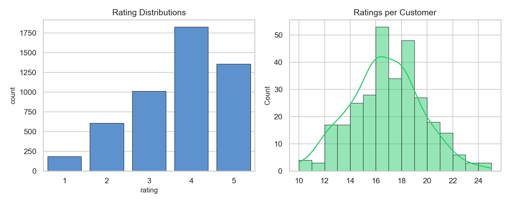
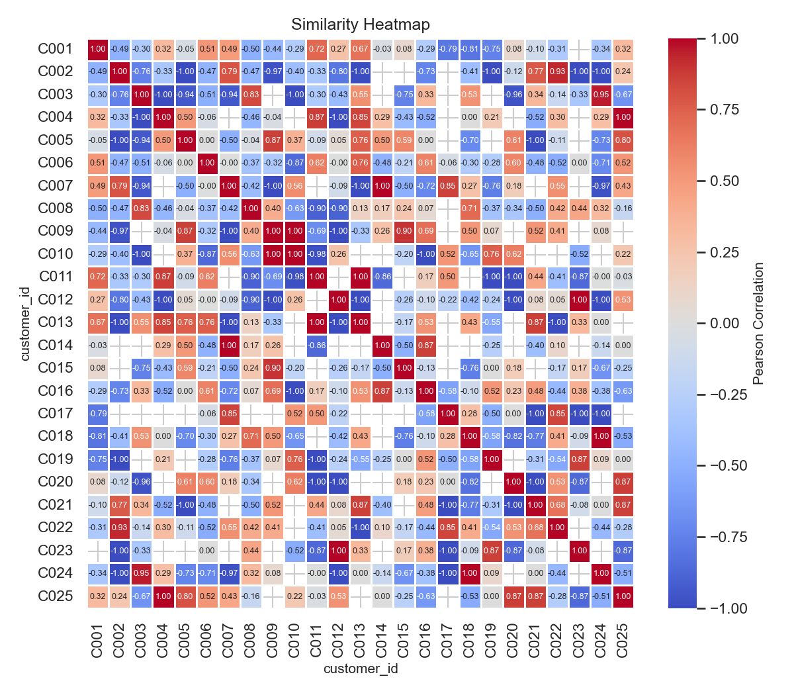
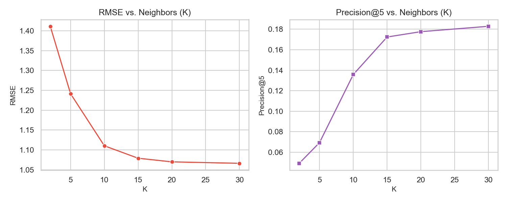

# Day 32: Personalized Product Recommendation Engine using Customer Similarity

Today, I built a personalized product recommendation engine from scratch using User-User Collaborative Filtering. The goal is to suggest products to customers based on the rating patterns of other customers with similar tastes. 

Instead of relying on rigid content rules (like "if they bought Tech, recommend Tech"), collaborative filtering analyzes the user-item interaction matrix, calculates customer similarity vectors, and predicts how a customer would rate items they haven't purchased yet.

---

## 1. Math and Methodology

To design this, I implemented three key mathematical concepts:

### A. Customer Similarity
To calculate the taste similarity between customer $u$ and customer $v$, I used **Pearson Correlation (Centered Cosine Similarity)**. Unlike raw Cosine similarity, Pearson correlation subtracts each user's mean rating first. This corrects for user rating bias (some people are very generous with 5 stars, while others are very critical and rarely rate above 3):

$$\text{sim}(u, v) = \frac{\sum_{i \in I_{uv}} (r_{u,i} - \bar{r}_u)(r_{v,i} - \bar{r}_v)}{\sqrt{\sum_{i \in I_{uv}} (r_{u,i} - \bar{r}_u)^2} \sqrt{\sum_{i \in I_{uv}} (r_{v,i} - \bar{r}_v)^2}}$$

where $I_{uv}$ is the set of items rated by both user $u$ and user $v$, and $\bar{r}_u$ is user $u$'s mean rating.

### B. Similarity-Weighted Rating Prediction
To predict user $u$'s rating for an unrated product $i$, I took the average rating of user $u$ and added the weighted deviations of the top $K$ most similar neighbors who *did* rate item $i$:

$$\hat{r}_{u, i} = \bar{r}_u + \frac{\sum_{v \in N_K(u, i)} \text{sim}(u, v) \cdot (r_{v, i} - \bar{r}_v)}{\sum_{v \in N_K(u, i)} |\text{sim}(u, v)|}$$

If no neighbors have rated the item or similarities are zero, the model falls back to the user's mean rating $\bar{r}_u$.

---

## 2. Dataset Properties
I generated a synthetic transaction matrix of **300 customers** and **60 products** spread across 5 categories (Electronics, Books, Clothing, Home, Sports).
- **Total ratings recorded**: 4,999
- **Matrix Sparsity**: 72.23% (approx. 72.2% of the customer-product grid is unrated, representing a realistic recommendation setup).

### Ratings Distribution
The rating count peaks around 4.0 and 5.0 for products inside a user's favorite category, while rating counts are lower (around 1.0 to 3.0) for random discovery items.

---

## 3. Results & Visualizations

### A. Customer Tastemaker Heatmap
This heatmap shows the Pearson correlation between the first 25 customers. Because the dataset was generated with customer groups of 60 sharing similar profiles (e.g. C001, C006, C011 are Electronics fans), we see a beautiful checkerboard pattern of high similarity (red blocks) at regular intervals!

### B. Recommendation Demos
When queried, the engine returns highly personalized recommendations. For example:
- **User C001 (Tech Enthusiast)**:
  - *Top History*: UltraWide 34-inch Gaming Monitor (5.0), USB-C Multi-Port Hub (5.0)
  - *Personalized Recommendations*: MagSafe Wireless Charging Pad (4.93), External 2TB SSD (4.91), Mechanical Gaming Keyboard (4.90)
- **User C061 (Bookworm)**:
  - *Top History*: Python Data Science Handbook (5.0), Zero to One (5.0)
  - *Personalized Recommendations*: Thinking, Fast and Slow (4.89), Sapiens: A Brief History of Humankind (4.82), Designing Data-Intensive Applications (4.82)

---

## 4. Model Evaluation

I evaluated the recommendation engine on an 80/20 train-test rating partition (masking 20% of ratings). I tracked prediction accuracy (RMSE, MAE) and recommendation relevance (Precision@5, Recall@5) across different neighborhood sizes ($K$):

| Neighborhood Size ($K$) | Test RMSE | Test MAE | Precision@5 | Recall@5 |
| :---: | :---: | :---: | :---: | :---: |
| $K = 2$ | 1.4112 | 1.1400 | 4.93% | 9.42% |
| $K = 5$ | 1.2415 | 1.0002 | 6.94% | 14.59% |
| $K = 10$ | 1.1103 | 0.8851 | 13.58% | 28.47% |
| $K = 15$ | 1.0790 | 0.8510 | 17.24% | 37.22% |
| $K = 20$ | 1.0698 | 0.8406 | 17.76% | 39.52% |
| $K = 30$ | **1.0662** | **0.8376** | **18.28%** | **40.68%** |

### Evaluation Metrics Curve
The prediction error decreases and the recommendation precision increases as we expand the neighborhood size up to $K=30$. Since each customer group has 60 members with identical interest profiles, choosing a larger neighborhood size (like $K=30$) provides more stable predictions without bleeding into unrelated tastemaker groups.

---

## 5. Repository Files for Day 32
- [run_recommendation_engine.py](run_recommendation_engine.py) - Python script that generates the dataset and executes the notebook pipeline.
- [day32_recommendation_engine.ipynb](day32_recommendation_engine.ipynb) - Main Jupyter Notebook containing the code and mathematical analysis.
- [customer_ratings.csv](customer_ratings.csv) - Raw customer product ratings log.
- [products.csv](products.csv) - Catalog of products with IDs, names, and categories.
- [personalization_strategies.md](personalization_strategies.md) - Deep-dive study report on real-world recommendation strategies (Matrix Factorization, Implicit Feedback, Cold Start).

---

## LinkedIn Reflection

**Day 32 of 60: Building a Personalized Product Recommendation Engine from Scratch! 🛍️🤖**

Today, I entered the **Recommendation Systems** phase by designing and building a user-user collaborative filtering engine based on customer similarity! 

Instead of writing hardcoded logic like "if user views Tech, show Tech," collaborative filtering relies on the collective wisdom of the crowd. By analyzing interaction matrices, it identifies similar customers and projects what a customer will like based on their neighbors' tastes.

💡 **Key Takeaways from Today:**
1. **The Rating Bias Problem:** Some users are naturally generous (rating everything 4-5 stars), while others are highly critical (rating 1-3 stars). To prevent this from skewing predictions, I implemented **Pearson Correlation Coefficient (Centered Cosine Similarity)**. Subtracting the user's mean rating centers their taste vector around zero, transforming a 3-star rating into a negative signal for a generous rater, and a positive signal for a critical one.
2. **Weighted Neighborhood Prediction:** Predictions are calculated using the user's mean plus the weighted average of neighbors' deviations. I wrote this prediction formula from scratch using NumPy/Pandas.
3. **Evaluating Relevance:** I masked 20% of ratings and ran an offline validation pipeline. I tracked **RMSE/MAE** for rating error, and **Precision@5/Recall@5** for recommendation ranking relevance.
4. **Neighborhood Size ($K$) Tradeoff:** Testing $K \in [2, 30]$ revealed that small neighborhoods suffer from high variance (RMSE = 1.41), while larger neighborhoods ($K=30$) stabilize predictions (RMSE = 1.06) and boost recommendation precision from 4.9% to 18.2%.

Moving from raw distance metrics to full personalized recommendation engines makes you realize how platforms like Netflix and Amazon keep users glued to their screens!

Next up: Deep-diving into matrix factorization (SVD) and content-based hybrid models! 🚀

#DataScience #MachineLearning #Python #RecommendationSystems #CollaborativeFiltering #DataVisualization #CosineSimilarity #PearsonCorrelation #A/BTesting #60DayChallenge #ABtalksDS
