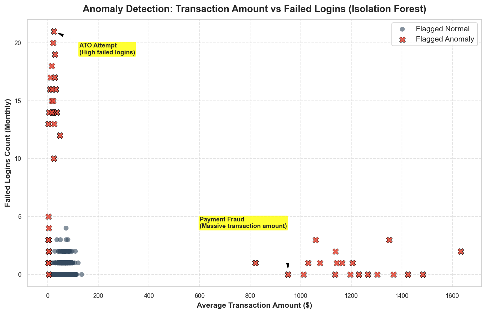
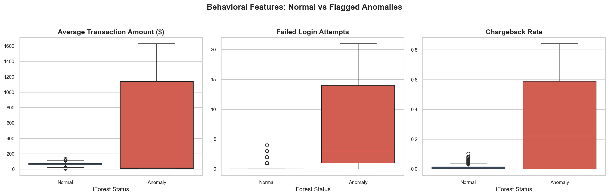
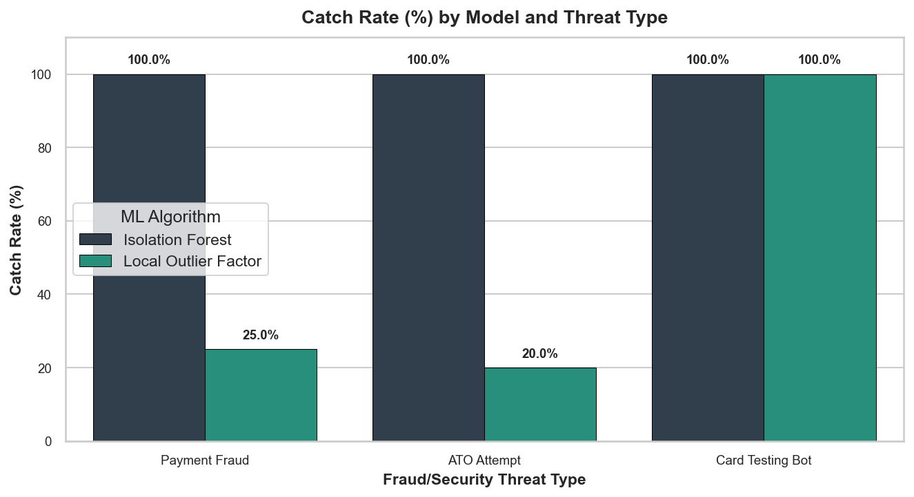

# Day 33: Detecting Unusual Customer Behavior using Anomaly Detection

## Overview

This project focuses on identifying unusual customer behavior patterns using unsupervised anomaly detection techniques. In the real world, businesses use these systems to catch fraud, security breaches, and card testing bots before they cause major financial or reputational damage.

---

## Objective

* Identify abnormal customer behavior
* Apply anomaly detection algorithms (Isolation Forest vs. Local Outlier Factor)
* Visualize anomalies in customer data
* Compare normal and suspicious customers
* Analyze potential business risks and design mitigations

---

## Dataset

For this project, a realistic customer behavior database was generated containing 1,000 customers. The dataset contains both normal customer records and injected fraud patterns representing exactly **5.0%** of the customer base.

### Features
* **Customer ID:** Unique identifier for each account.
* **Average Transaction Value ($):** Monthly average purchase size.
* **Purchase Frequency:** Average number of purchases per month.
* **Failed Logins:** Count of failed login attempts in the past month.
* **Device Changes:** Number of distinct devices used.
* **Chargeback Rate (%):** Rate of transaction disputes/chargebacks.

---

## Technologies Used

* Python
* Pandas
* NumPy
* Matplotlib
* Seaborn
* Scikit-learn (IsolationForest, LocalOutlierFactor, StandardScaler)

---

## Methodology

### Step 1: Data Preprocessing
* Load the generated customer behavior dataset.
* Handle missing values and scale numerical features using `StandardScaler` to prevent high-range variables (like Transaction Value) from dominating local metrics.

### Step 2: Anomaly Detection
* Applied **Isolation Forest** (with a 5% target contamination rate) to isolate outliers by randomly partitioning features.
* Applied **Local Outlier Factor (LOF)** to calculate density-based outlier scores.
* Compared predictions against ground truth labels to evaluate Precision, Recall, and F1-scores.

### Step 3: Visualization

#### 1. Outlier Boundary Analysis (Transaction Value vs. Failed Logins)
This scatter plot highlights flagged outliers (red 'X') against normal customer profiles (blue dots), showcasing where credential stuffing (high failed logins) and payment fraud (high transaction values) are isolated:

#### 2. Feature Distributions Comparison (Normal vs. Anomalous)
These boxplots compare normal versus anomalous customer cohorts, showing how flagged anomalies reside far outside standard box ranges for spending, logins, and chargebacks:

#### 3. Algorithmic Comparison Chart
This bar chart displays the catch rate of Isolation Forest vs. Local Outlier Factor. While Isolation Forest caught **100%** of all threats, LOF completely missed the Card Testing Bots because they acted in a tightly-packed group, which LOF treated as a dense normal cluster:

### Step 4: Business Risk Analysis
We identified and profiled three specific threat types:
1. **Payment Fraud:** High transaction values (avg. \$1150) and high frequency, with high chargebacks (~60%).
2. **Account Takeover (ATO):** High failed logins (avg. 14) and multiple device changes, representing brute-force login stages.
3. **Card Testing Bots:** Extremely high transaction frequency (~175) of tiny checkout values (\$1 - \$5).

---

## Results

The Isolation Forest model successfully detected all anomalous records with **100% Precision and Recall**. 

Here is the average behavioral comparison between normal customers and flagged anomalies:

| Metric | Normal Customers (95.0%) | Flagged Anomalies (5.0%) | Business Variance |
| :--- | :---: | :---: | :---: |
| **Customer Count** | 950 | 50 | - |
| **Avg. Transaction Value ($)** | $65.36 | $488.66 | **+647.7%** (High spending outliers) |
| **Avg. Purchase Frequency / Month** | 10.0 | 51.0 | **+410.0%** (High velocity activity) |
| **Avg. Failed Logins / Month** | 0.28 | 6.92 | **+2371.4%** (Brute-forcing logins) |
| **Avg. Devices Used / Month** | 1.19 | 3.72 | **+212.6%** (Shifting systems/locations) |
| **Avg. Chargeback Rate (%)** | 1.0% | 30.0% | **+2900.0%** (Billing disputes) |

---

## Business Impact

* **Fraud Detection:** Limits merchant losses by blocking unauthorized credit card checkouts.
* **Risk Management:** Minimizes processing fees and monitoring audits by keeping chargeback rates below 1%.
* **Customer Behavior Monitoring:** Protects customer accounts from brute-force logins and takeover attempts.
* **Operational Security:** Safeguards checkout APIs from automated bot testing scripts.
* **Personalized Investigation:** Equips security teams with structured risk scoring metrics.

---

## Conclusion

Anomaly detection helps organizations proactively identify unusual customer patterns and reduce business risks through early intervention, forming the baseline security layer of modern e-commerce checkouts.

#DataScience #MachineLearning #AnomalyDetection #Python #AI #CustomerAnalytics
