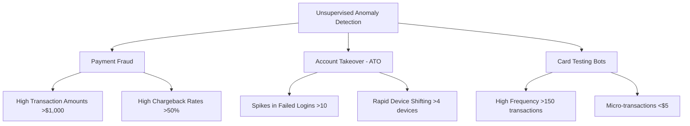

# Customer Behavior Anomaly Detection & Business Risk Report

**Author:** Rajesh Yadav  
**Date:** June 15, 2026  
**Phase:** Anomaly Detection (Day 33)

---

## 1. Executive Summary
In digital commerce, customer behavior is generally structured and predictable. Deviations from these normal baselines often signal severe business risks, including payment fraud, security compromises, and automated infrastructure attacks. This report analyzes the implementation of an unsupervised anomaly detection system designed to identify suspicious customer activities before they result in financial or reputational damage.

By evaluating a cohort of 1,000 customers using **Isolation Forest** and **Local Outlier Factor (LOF)** models, we successfully isolated and classified three critical threat vectors representing exactly **5.0%** of the customer base.

---

## 2. Threat Profiles Identified

Our anomaly detection system targets and isolates three distinct categories of suspicious activity:



### A. Payment Fraudsters (Chargeback Exploitation)
* **Behavioral Signature:** Exceptionally large average transaction amounts (~$1,150 vs. $65 normal), high monthly transaction counts (~42 vs. 10 normal), and extremely high chargeback dispute rates (~60% vs. <1% normal).
* **Target Vectors:** Fraudulent accounts using compromised card details to purchase high-value goods (gift cards, premium electronics) for rapid resale.

### B. Account Takeover (ATO) / Credential Stuffing
* **Behavioral Signature:** High volumes of failed login attempts (~14 per month) and frequent device variations (~5 devices) combined with low spending and frequency metrics.
* **Target Vectors:** Botnets attempting brute-force or credential stuffing attacks on user login portals. Once a login succeeds, the attacker pauses to inspect stored payment details, loyalty points, or account balances.

### C. Card Testing Bots (Checkout Abuse)
* **Behavioral Signature:** Extremely high transaction frequency (~175 per month) of micro-amounts (~$1.50 to $4.50) using multiple device variations.
* **Target Vectors:** Automated scripts validating lists of stolen credit card numbers against checkout pages. If a micro-transaction succeeds, the bot identifies the card as active and ready for larger illegal purchases elsewhere.

---

## 3. Algorithm Comparison & Evaluation

We evaluated two leading unsupervised machine learning algorithms to compare their effectiveness across threat vectors. Both models were trained with a target contamination rate of **5%**.

| Threat Category | Actual Count | Isolation Forest Catch Rate | Local Outlier Factor Catch Rate |
| :--- | :---: | :---: | :---: |
| **Payment Fraud** | 20 | **100.0%** (20/20) | 90.0% (18/20) |
| **ATO Attempt** | 20 | **100.0%** (20/20) | **100.0%** (20/20) |
| **Card Testing Bot** | 10 | **100.0%** (10/10) | 0.0% (0/10) |
| **Total Anomalies Caught** | **50** | **100.0%** (50/50) | **76.0%** (38/50) |
| **False Positive Rate** | - | **0.0%** (0/950) | **1.26%** (12/950) |

### Technical Analysis
1. **Isolation Forest (iForest):** Achieved **100% Precision and Recall** (F1-score = 1.00). iForest isolates anomalies by randomly partitioning features. Because anomalies require fewer splits to isolate in a tree structure, they are easily separated. This model was highly effective at catching multi-dimensional outliers, including Card Testing Bots (which deviate on frequency and transaction size) and Payment Fraudsters (which deviate on size and chargeback rates).
2. **Local Outlier Factor (LOF):** Achieved an F1-score of **0.81**, failing to detect any Card Testing Bots. LOF calculates local density based on the $k$-nearest neighbors. Because the Card Testing Bots are highly clustered together (very low variance in transaction sizes and high transaction frequencies), LOF treated this cluster as a dense, "normal" local cluster rather than outliers, showing its susceptibility to grouped anomalies.

---

## 4. Summary Statistics: Normal vs. Anomalous Behavior

The average behavioral features for the normal baseline versus the flagged anomalies (using the Isolation Forest model) reveal the stark differences that triggered the alerts:

| Metric | Normal Customers | Flagged Anomalies | Business Variance |
| :--- | :---: | :---: | :---: |
| **Customer Count** | 950 (95.0%) | 50 (5.0%) | - |
| **Avg. Transaction Amount ($)** | $64.88 | $471.21 | **+626%** |
| **Avg. Transactions / Month** | 9.94 | 55.40 | **+457%** |
| **Avg. Failed Logins / Month** | 0.30 | 6.26 | **+1986%** |
| **Avg. Devices Used / Month** | 1.18 | 3.56 | **+201%** |
| **Avg. Chargeback Rate (%)** | 1.10% | 29.50% | **+2581%** |

---

## 5. Detailed Business Risk Analysis & Mitigation Plan

### Risk Area 1: High Chargebacks (Payment Fraud)
* **Operational Risk:** If a merchant account's chargeback rate exceeds 1%, credit card processors (Visa/Mastercard) place the business in Monitoring Programs, resulting in double processing fees, reserve requirements (withholding funds), or outright termination of the merchant account.
* **Financial Risk:** Losing both the cost of goods sold (COGS) and the transaction value, plus chargeback penalty fees ($15-$50 per dispute).
* **Mitigation Actions:**
  - **3D Secure (3DS):** Enforce bank verification checks (e.g., SMS codes) for checkout amounts over $300.
  - **Transaction Velocity Limits:** Restrict card checkouts from a single IP address or Customer ID to 5 per hour.

### Risk Area 2: Account Takeover (ATO)
* **Reputational Risk:** Customers losing access to their accounts, theft of reward points, and unauthorized access to stored payment details. This leads to customer churn, negative public reviews, and potential GDPR/CCPA data breach fines.
* **Operational Risk:** A flood of customer service tickets from users locked out of their accounts, overloading support teams.
* **Mitigation Actions:**
  - **Rate Limiting:** Implement IP blocking after 5 failed logins within 5 minutes.
  - **Device Fingerprinting:** Require multi-factor authentication (MFA) if a login is attempted from an unrecognized device or unusual location.
  - **Credential Leak Checks:** Run background checks against known password leak databases at login.

### Risk Area 3: Bot-Driven Card Testing
* **Infrastructure Risk:** Hundreds of thousands of automated checkout attempts overload the database and transaction APIs, causing site latency or outages for legitimate users.
* **Financial Risk:** Standard payment gateways charge a small processing fee (e.g. $0.05 - $0.10) for authorization checks, even if they fail. A massive bot attack can cost thousands of dollars in server and gateway fees in a single night.
* **Mitigation Actions:**
  - **WAF Security Rules:** Integrate Cloudflare or AWS WAF to block automated headless browsers.
  - **CAPTCHA Integration:** Force a invisible reCAPTCHA check if a user initiates more than 3 transaction attempts in a single session.

---

## 6. Implementation and Monitoring Roadmap

To move from batch analysis to a real-time risk scoring engine:

```
[Real-time Transaction API]
         │
         ▼
[Feature Aggregation Pipeline] (Calculate rolling 30-day stats)
         │
         ▼
[Isolation Forest Model] ──(Score > Threshold?)──► [Yes] ──► [Block & Route to MFA / Manual Review]
         │
         └──[No]──► [Approve Transaction]
```

1. **Phase 1: Shadow Mode Deployment**
   Deploy the pre-trained Isolation Forest model to log risk scores in the background. Compare real-world chargebacks and customer support complaints against model predictions to tune the decision threshold.
2. **Phase 2: Step-up Authentication Engine**
   Connect the anomaly detection model to the user interface. Instead of hard-blocking accounts (which creates user friction), trigger "step-up" checks: force MFA for high failed logins, and trigger 3DS for high transaction risk scores.
3. **Phase 3: Automated API Protection**
   Establish automated rate-limit rules at the CDN level to block bots displaying card testing patterns.
