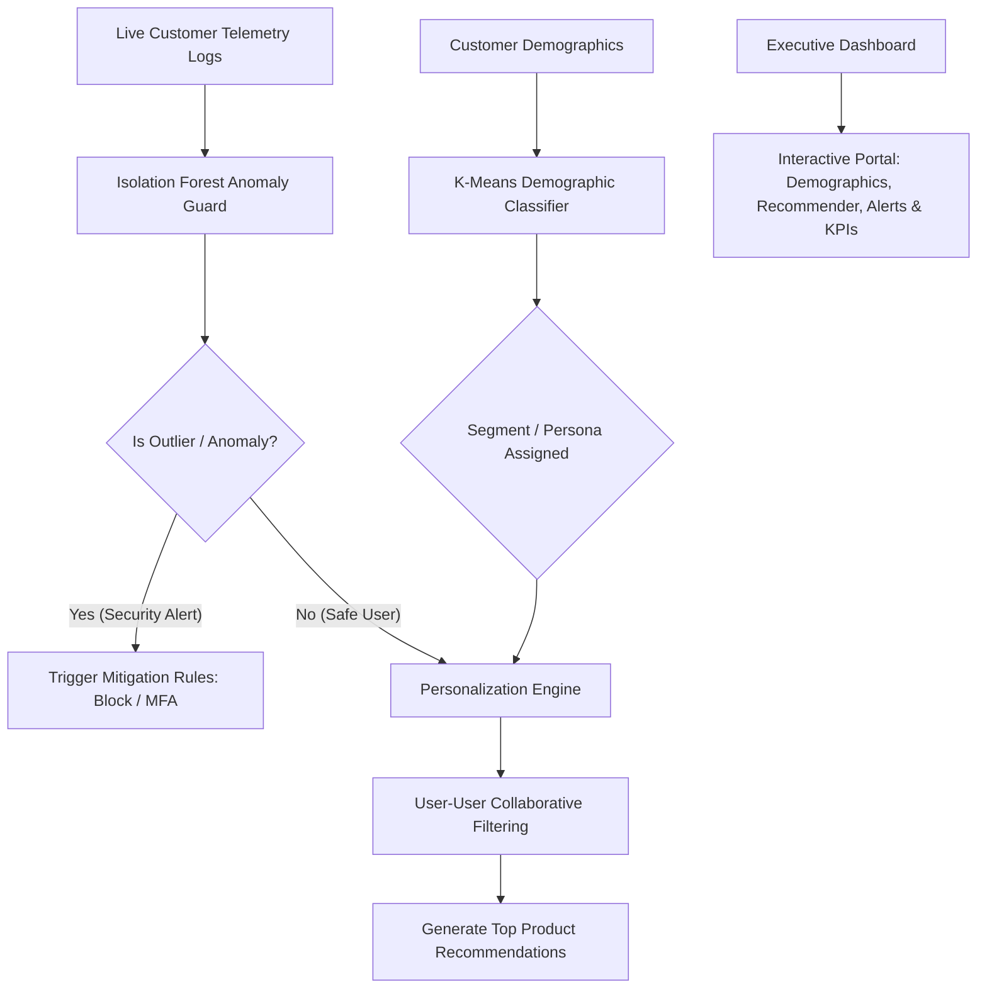

# Day 35: Combined Customer Intelligence & Analytics Platform

This folder contains my integrated submission for the Week 5 Sprint Review & System Integration. Over the past week, I developed separate customer analytics components. Today, I integrated all of them into a unified platform to demonstrate how businesses can coordinate customer segmentation, personalized product recommendations, and security/fraud anomaly detection.

---

## Workflow Architecture Diagram

The diagram below maps out how customer demographics and real-time transaction events are routed through the system to personalize user experiences while guarding against security threats.



---

## System Engineering Trade-offs

When designing this platform, I had to evaluate several engineering trade-offs regarding where computation takes place, how models interact, and how security rules affect user experience:

### 1. Compute Latency vs. Persona Accuracy (Segmentation)
* **Option A (Batch):** Run K-Means clustering offline weekly, save the cluster labels inside the SQL database, and retrieve them via indexed lookups.
* **Option B (Real-time):** Fit/predict K-Means dynamically on every session load.
* **My Decision:** I chose **Option A (Offline Batch)**. Customer demographics (Age, Income, Spending score) change very slowly. Re-running clustering algorithms on every page load would waste server resources and increase frontend load times.

### 2. User-User Collaborative Filtering Scalability
* **The Problem:** The Pearson similarity correlation matrix requires calculating matches across all customer profiles. With 300 customers, this runs in milliseconds. However, as the customer database scales to millions of users, computing a user-user similarity matrix online becomes computationally impossible ($O(U^2)$ time complexity).
* **Mitigation:** In production, we would need to transition to **Item-Item Collaborative Filtering** (since product catalogs grow slower than user bases) or factorize the rating matrix offline into **Latent Embeddings (SVD or ALS)**. This allows real-time recommendations to be generated via fast dot-product lookups.

### 3. Anomaly Contamination Rate vs. User Friction
* **The Problem:** The Isolation Forest model requires tuning a contamination parameter (our baseline is set to 5%). 
* **Tuning Trade-off:** 
  * If we tune it high (e.g. 10%), we catch more subtle security outliers (higher security), but we also increase False Positives. This means normal, high-value customers might get blocked or forced to do annoying MFA checks, causing checkout abandonment.
  * If we tune it low (e.g. 1%), we reduce customer friction but allow credit card testing bots or account takeover hackers to compromise the checkouts.

---

## Core Code Structure & Execution

The integration pipeline is structured as follows:
* [run_integration.py](file:///c:/60-days-data-science/day35/run_integration.py): The model runner that reads Mall Customers demographics, behavior logs, and ratings. It trains the K-Means, Isolation Forest, and Collaborative Filtering matrix, tests them against validation profiles, and programmatically compiles/executes the Jupyter Notebook.
* [day35_integration.ipynb](file:///c:/60-days-data-science/day35/day35_integration.ipynb): The executed Jupyter Notebook showing outputs, evaluation plots, and pipeline logic.
* [app.py](file:///c:/60-days-data-science/day35/app.py): The Streamlit dashboard that serves as our user interface.

### Running the Dashboard Locally

1. **Install Requirements:**
   ```bash
   pip install streamlit pandas numpy matplotlib seaborn scikit-learn
   ```
2. **Execute the Streamlit App:**
   From the project workspace root, run:
   ```bash
   streamlit run day35/app.py
   ```

---

## Week 5 Sprint Reflection

This week was the most challenging sprint of the challenge so far because it moved from standalone models to system integration. 

Here are my major takeaways:
* **Machine Learning Interdependence:** Standalone models are rarely useful in isolation. Building a decision system requires cascading logic. For instance, anomaly detection must act as a gateway/security guard *before* personalization runs, because showing tailored items to bots is useless and wastes API resources.
* **Cold-Start Handling:** Recommendation systems depend heavily on historic ratings. For new customers, we need a robust fallback plan. Using demographic segments (K-Means) to suggest trending category items proved to be an elegant way to resolve the cold-start problem without presenting an empty page.
* **Designing for Business Outcomes:** Building dashboard tabs showed me that data visualization must cater to different business audiences. Executives need macro metrics (monthly recurring revenue, general churn rates), whereas risk operations teams need specific, actionable alerts (IP blocks, MFA verification logs). 

This sprint has helped me transition from thinking like a model builder to thinking like an analytics systems engineer.

---

## LinkedIn Post Draft

**Title:** Week 5 Wrap-up: Integrating Customer Data Pipelines

Just completed Week 5 of my 60-Day Data Science Challenge! This week focused on combining separate analytical components into a unified Customer Intelligence Platform.

Instead of writing isolated scripts, I focused on system integration. I built a decision pipeline in Python that connects three core layers:
1. Demographic Segmentation: Grouping users into personas using K-Means clustering.
2. Behavioral Security Guard: Using an Isolation Forest model to detect transaction and login anomalies in real-time (fraud and account takeover checks).
3. Personalization Routing: Delivering personalized product recommendations using User-User Collaborative Filtering, with automatic fallback to popular items in their demographic persona for new users (solving the cold-start problem).

I also deployed a Streamlit dashboard that allows stakeholders to query any customer ID and instantly see demographic personas, transaction security statuses, and recommendations.

 Tying these pieces together made me realize that production ML is not just about model accuracy, but about data routing, handling latency, and minimizing user friction.

On to Week 6! 

#DataScience #MachineLearning #Streamlit #CustomerAnalytics #60DaysOfDataScience #SystemIntegration
