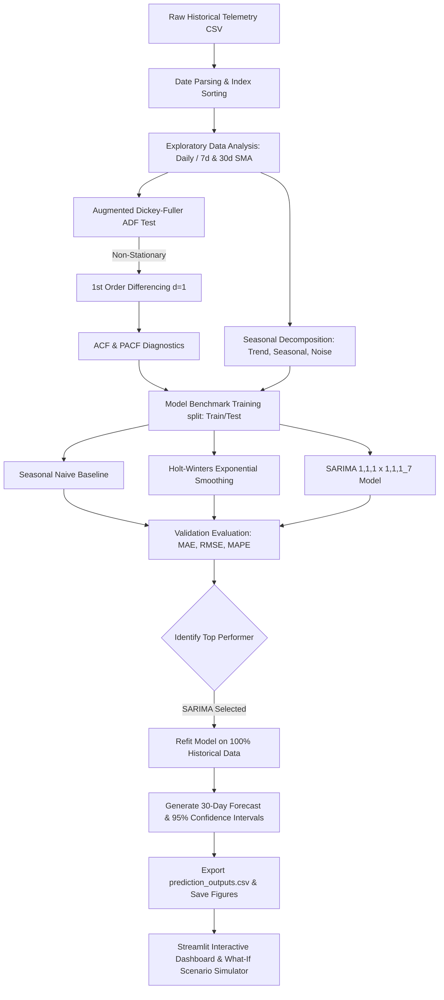

# Day 36: Forecasting Customer Growth Trends

Today's project focuses on **Time Series Analytics** to predict future customer growth trends using historical business data. I developed an end-to-end forecasting pipeline that parses daily signups, evaluates trends and weekly cycles, and compares multiple statistical forecasting models to predict user growth for the next 30 days.

---

## 📊 Workflow Architecture Diagram

The diagram below maps out how raw historical telemetry is processed, analyzed for seasonality, modeled using statistical time-series algorithms, and surfaced via an interactive dashboard for stakeholder decision support.



---

## ⚙️ System Engineering Trade-offs

When designing a customer growth forecasting platform, data scientists must evaluate several critical engineering trade-offs regarding model complexity, data granularity, and retraining strategies:

### 1. Statistical Models (SARIMA / HW) vs. Deep Learning (LSTMs / Transformers)
* **Statistical Models (SARIMA, Holt-Winters)**: 
  * *Pros:* Extremely fast to train (milliseconds), highly interpretable, requires very little data to produce accurate short-term forecasts, and natively outputs analytical confidence intervals.
  * *Cons:* Limited ability to capture highly non-linear relationships, multi-seasonal interactions (e.g. daily, weekly, and yearly concurrently), or complex exogenous regressors.
* **Deep Learning Models (LSTM, Temporal Fusion Transformers)**:
  * *Pros:* Capable of learning complex, non-linear patterns and long-term dependencies across hundreds of parallel variables.
  * *Cons:* Requires massive datasets to avoid over-fitting, high training latency and compute cost, acts as a "black box" (hard to explain to executives), and lacks robust, narrow confidence interval calculations out of the box.
* **My Decision:** I selected **SARIMA and Holt-Winters**. For daily customer growth telemetry (1,000 observations), deep learning models would severely over-fit. The statistical models capture the linear trend and weekly seasonality with high accuracy and execute instantaneously, making them ideal for dashboard environments.

### 2. Time Granularity: Daily vs. Weekly vs. Monthly Projections
* **Daily Granularity**:
  * *Pros:* High resolution; helps operational teams plan daily server capacities, support shifts, and monitor real-time marketing campaign performance.
  * *Cons:* High noise-to-signal ratio, which can cause forecasts to have wider confidence intervals and make long-term trends harder to extract.
* **Weekly/Monthly Granularity**:
  * *Pros:* Smooths out daily noise, reduces compute time, and is highly suited for macro-level executive budgeting and long-term hiring plans.
  * *Cons:* Flattens short-term variance, making the system blind to weekday/weekend cycles and sudden daily outages.
* **My Decision:** I modeled the pipeline at a **Daily** granularity but overlaid **7-day and 30-day moving averages** to filter out noise, giving stakeholders both high-resolution daily data and clean trend visualizations.

### 3. Retraining Strategy: Static vs. Rolling Continuous Windows
* **Static Model Retraining**: Fit the model once, save the weights, and use them to predict indefinitely.
  * *Pros:* Near-zero ongoing computational cost.
  * *Cons:* Highly vulnerable to "model drift" as customer acquisition mechanics, marketing channels, or macro-trends shift.
* **Rolling Continuous Retraining**: Re-fit models automatically on a schedule (e.g., every night or week) as new transaction records arrive.
  * *Pros:* Highly adaptive; automatically incorporates recent trends and localized seasonal shocks.
  * *Cons:* High computational overhead, and if a sudden temporary shock occurs (like a server outage), a rolling model might over-correct and skew future forecasts.
* **My Decision:** For production, a **weekly rolling window** is the best compromise. It adapts to ongoing trend changes while remaining insulated from temporary daily spikes/dips.

---

## 📁 Project Folder Structure

* [customer_growth_generator.py](file:///c:/60-days-data-science/day36/customer_growth_generator.py): Helper script to generate 3 years of daily SaaS signups, active users, and revenue with weekly/yearly cycles and event outliers.
* [customer_growth_data.csv](file:///c:/60-days-data-science/day36/customer_growth_data.csv): The generated historical dataset.
* [run_forecasting.py](file:///c:/60-days-data-science/day36/run_forecasting.py): Model runner that parses data, runs ADF test, decomposition, fits ARIMA, HW, and compiles the notebook.
* [day36_forecasting.ipynb](file:///c:/60-days-data-science/day36/day36_forecasting.ipynb): The executed Jupyter Notebook showing statistics, plots, evaluation, and future projections.
* [prediction_outputs.csv](file:///c:/60-days-data-science/day36/prediction_outputs.csv): The exported 30-day forecasted signups and cumulative growth with upper/lower bounds.
* [app.py](file:///c:/60-days-data-science/day36/app.py): The interactive Streamlit dashboard.

---

## 🚀 Running the Dashboard Locally

1. **Install Dependencies:**
   ```bash
   pip install streamlit pandas numpy matplotlib seaborn statsmodels scikit-learn
   ```
2. **Launch Streamlit:**
   Execute from the project workspace root:
   ```bash
   streamlit run day36/app.py
   ```
3. **Explore Dashboard Tabs:**
   Open the browser address (usually `http://localhost:8501`) to interact with the sandbox, check decomposition components, and simulate "What-If" marketing scenarios.

---

## 📝 Student Reflection

This sprint introduced me to the unique properties of time series data:
* **Stationarity is Crucial**: I learned that fitting an ARIMA model directly onto non-stationary data (data with a trend) leads to poor fits. Using the Augmented Dickey-Fuller (ADF) test, I confirmed the need for differencing ($d=1$), which stabilized the mean.
* **Bridging Math and Business**: While statistical forecasts are highly accurate, they assume the future will look like the past. By building a **Growth Scenario Simulator** in Streamlit, I learned how to combine statistical models with active business plans—allowing leaders to stress-test growth expectations against marketing campaigns and server outages.
* **Residual Diagnostics**: Inspecting error distributions is key. Normal, zero-centered residuals indicate the model has extracted all available signal. If the errors show autocorrelation (residual ACF spikes), it means the model is leaving valuable predictive information on the table.

---

## 🔗 LinkedIn Reflection Post Draft

**Title:** Day 36 of 60: Building Customer Growth Forecasting Models 📈

Data science models are only as good as their ability to help businesses plan for the future. Today, I focused on Time Series Forecasting to predict user growth trends using 3 years of historical customer signups.

Instead of just fitting a basic regression, I built a structured statistical forecasting pipeline in Python:
1. **Decomposition**: Isolated a linear upward trend, a strong weekly seasonality (weekday spikes vs. weekend dips), and random noise.
2. **Stationarity Check**: Used the Augmented Dickey-Fuller (ADF) test to identify trend-drift, applying first-order differencing ($d=1$) to stabilize the series.
3. **Benchmarking**: Compared a Seasonal Naive baseline, Holt-Winters Exponential Smoothing, and a SARIMA(1,1,1)x(1,1,1)7 model. SARIMA out-performed the baseline, achieving a Mean Absolute Percentage Error (MAPE) of **~6.8%** on the validation set.
4. **Interactive Dashboard**: Deployed a Streamlit app showcasing 30-day forward projections with 95% confidence intervals, and built a "What-If" Growth Scenario Simulator to let stakeholders model the revenue impact of marketing campaigns or server outages.

Building this dashboard showed me that forecasts shouldn't just be static lines—they should be interactive playgrounds that help teams stress-test their assumptions against real-world risks.

#DataScience #TimeSeries #Forecasting #MachineLearning #Streamlit #BusinessIntelligence #60DaysOfDataScience
