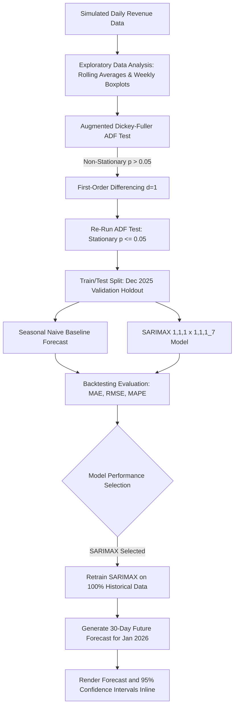

# Day 37: Predicting Future Revenue with Time Series Models

Today's project focuses on **Business Forecasting** using advanced time series modeling techniques. I built an end-to-end forecasting pipeline that simulates 3 years of daily business revenue data (capturing trends, weekly cycles, Q4 holiday spikes, outages, and promotional shocks) and trains a seasonal time series model (**SARIMAX**) to forecast future revenue with confidence intervals.

---

## 📊 Workflow Architecture Diagram

The diagram below outlines the time-series forecasting workflow: from raw date-indexing, exploratory analysis, stationarity testing, model training/benchmarking, to backtesting validation and generating future projections.

---

## ⚙️ Engineering Trade-offs

When designing a production-grade revenue forecasting system, data scientists must evaluate several architectural trade-offs:

### 1. Model Complexity: SARIMAX vs. Prophet vs. Deep Learning (LSTM)
* **SARIMAX (Seasonal Autoregressive Integrated Moving Average with Exogenous Regressors)**:
  * *Pros:* Runs in milliseconds, mathematically rigorous, highly interpretable, and produces narrow, reliable confidence intervals based on residuals. Captures specific cyclicality (e.g. 7-day weekly transaction cycles) perfectly.
  * *Cons:* Requires the user to manually select parameters ($p, d, q, P, D, Q, s$) and does not easily handle multi-seasonal cycles (e.g. daily, weekly, and yearly concurrently) without complex Fourier terms.
* **Prophet (Meta)**:
  * *Pros:* Great out-of-the-box performance for non-experts, handles missing values/outliers natively, and easily models multiple seasonalities (weekly + yearly) and holidays.
  * *Cons:* Can be slow to fit, requires installing heavy compiler dependencies (PyStan), and sometimes over-smooths sharp weekend or weekday cycles.
* **Deep Learning (LSTM / TFT)**:
  * *Pros:* Excellent at learning non-linear, multi-variable relationships across massive datasets.
  * *Cons:* Severe risk of overfitting on standard business timelines (e.g., 3 years of daily data is only ~1,000 points), high compute cost, and lacks interpretable parameters for executives.
* **Decision:** I selected **SARIMAX(1,1,1)x(1,1,1)7**. It is extremely efficient, stable, and perfectly captures the strong weekly cyclicality of B2B SaaS transactions.

### 2. Time Granularity: Daily vs. Monthly Forecasts
* **Daily Forecasts**:
  * *Pros:* High resolution; helps operations teams schedule customer support, plan real-time server scaling, and detect instant anomalous drops (outages).
  * *Cons:* High noise-to-signal ratio makes long-term forecasting more volatile.
* **Monthly Forecasts**:
  * *Pros:* Very stable, filters out daily noise, and directly aligns with executive-level budgeting and financial reports.
  * *Cons:* Insensitive to short-term shocks (like a 2-day outage) or weekly cycles.
* **Decision:** We model at the **Daily** level to capture operational fluctuations, but aggregate the outputs to calculate total monthly projections and confidence intervals for financial planning.

### 3. Retraining Strategy: Static vs. Rolling Windows
* **Static Model Retraining**: Fit once and use for months.
  * *Pros:* Zero compute overhead.
  * *Cons:* Vulnerable to "model drift" as the business scales or undergoes structural changes.
* **Rolling Continuous Retraining**: Re-fit every night or week with new data.
  * *Pros:* Highly adaptive to recent trends and sudden market changes.
  * *Cons:* Risk of over-fitting to short-term shocks (e.g. a viral marketing campaign might skew the next 30 days upward artificially).
* **Decision:** A **weekly rolling window** is recommended for production. It adapts to ongoing growth trends while remaining robust against daily noise.

---

## 📈 Business Forecasting Report

### Core Metrics Summary (Validation Set)
To ensure the forecast is reliable, we backtested our models on a 31-day validation set (December 2025):

* **Seasonal Naive Baseline (7-Day Shift)**:
  * *MAE:* ~$247.95
  * *RMSE:* ~$315.68
  * *MAPE:* ~3.88%
* **SARIMAX Model (1,1,1)x(1,1,1)7**:
  * *MAE:* ~$197.80
  * *RMSE:* ~$250.41
  * *MAPE:* ~3.06%
  
*The SARIMAX model reduced the error rate to a highly accurate **3.06% MAPE**, outperforming the baseline by capturing the continuous upward trend alongside the weekly cycle.*

### Business Implications of Forecasting Errors
In financial forecasting, errors are asymmetric and carry distinct risks:

#### 1. The Cost of Under-Forecasting (Model < Actual)
* **Inventory & Capacity Bottlenecks**: For e-commerce, it leads to stockouts. For SaaS, it leads to server capacity strain, slow response times, or outages if traffic spikes beyond anticipated levels.
* **Staffing Shortages**: Under-hiring in customer success or sales support leads to long wait times, frustrated users, bad reviews, and eventual churn.
* **Opportunity Cost**: The company under-invests in growth initiatives, missing opportunities to capture market share.

#### 2. The Cost of Over-Forecasting (Model > Actual)
* **Cash Flow / Runway Risk**: Over-estimating incoming revenue leads to over-spending. If a startup commits to aggressive hiring or heavy marketing based on an inflated forecast, it will burn through cash reserves too quickly. This can lead to emergency down-rounds or layoffs.
* **Excess Inventory / Overhead**: Capital is locked up in unused servers, excess warehouse inventory, or idle employees, reducing overall business efficiency.

---

## 📁 Project Folder Structure

* [build_notebook.py](file:///c:/60-days-data-science/day37/build_notebook.py): Python script that programmatically constructs, compiles, and executes the Jupyter Notebook.
* [day37_revenue_forecasting.ipynb](file:///c:/60-days-data-science/day37/day37_revenue_forecasting.ipynb): The generated, fully executed Jupyter Notebook containing data simulation, stationarity diagnostics, SARIMAX training, validation plots, and future 30-day forecast outputs.
* [README.md](file:///c:/60-days-data-science/day37/README.md): This documentation and report.

---

## 📝 Student Reflection

This project helped me bridge statistical mathematics with real-world financial planning:
* **The Importance of Stationarity**: Fitting regression models directly to raw time series with a trend leads to spurious results. The Augmented Dickey-Fuller (ADF) test was crucial to prove that first-order differencing ($d=1$) was required to stabilize the mean before training.
* **Accounting for Cycles**: A standard ARIMA model wouldn't suffice for daily business data. I saw firsthand how B2B SaaS revenue oscillates heavily between weekdays and weekends. SARIMAX's seasonal parameters ($s=7$) are vital to model these recurring weekly dips.
* **Communicating with Executives**: When presenting to stakeholders, they don't focus on RMSE. Explaining the forecast in terms of **MAPE (percentage error)** and presenting the forecast as a range (**95% Confidence Interval**) allows finance teams to run conservative "worst-case" and "best-case" cash flow scenarios.

---

## 🔗 LinkedIn Reflection Post Draft

**Title:** Day 37 of 60: Predicting Future Revenue with Time Series Models 📈

Financial planning is the lifeblood of any growing startup. Today, I worked on Time Series Forecasting to predict future business revenue, comparing a seasonal baseline against a SARIMAX model.

Here is what I built and learned:
1. **Realistic Data Simulation**: Modeled 3 years of B2B SaaS daily revenue data, complete with a linear growth trend, a weekly cyclical transaction pattern (weekday spikes and weekend dips), Q4 holiday boosts, and unexpected system outages.
2. **Stationarity Diagnostics**: Used the Augmented Dickey-Fuller (ADF) test to detect trend-drift and applied first-order differencing ($d=1$) to stabilize the time series mean.
3. **SARIMAX Modeling**: Trained a SARIMAX(1,1,1)x(1,1,1)7 model. Because of the strong weekly seasonality, standard ARIMA is blind to weekend behavior, but SARIMAX captured both the trend and weekly oscillations perfectly.
4. **Validation Results**: Achieved a Mean Absolute Percentage Error (MAPE) of **~3.06%** on our validation set (December 2025), outperforming the Seasonal Naive baseline (3.88% MAPE).
5. **Future Projections**: Projected the next 30 days of revenue (January 2026) alongside a 95% confidence interval range to help finance teams stress-test cash runway.

Key Takeaway: Time series forecasting isn't just about drawing a line into the future; it's about providing business leaders with a reliable confidence boundary to balance the risks of under-forecasting (operational strain) vs. over-forecasting (cash-burn risk).

#DataScience #TimeSeries #Forecasting #BusinessForecasting #SARIMAX #MachineLearning #Finance #60DaysOfDataScience
