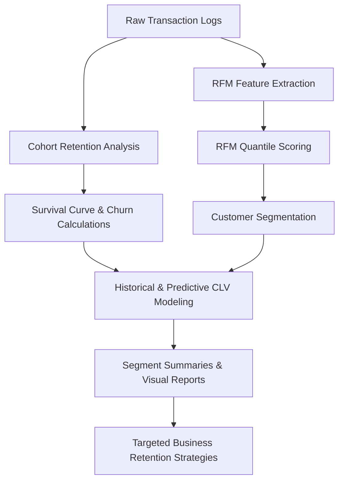

# Day 38: Analyzing Customer Retention and Lifetime Value

This project implements a customer retention and Customer Lifetime Value (CLV) analytics system. By analyzing transactional history, we group customers into cohorts by their signup month to measure retention decay, perform RFM (Recency, Frequency, Monetary) segmentation to identify high-value customer groups, and estimate both historical and predictive CLV to guide marketing and retention efforts.

---

## Workflow Architecture Diagram

The flow of raw transactions to segment-level retention strategies is shown below:

---

## Engineering Trade-offs

### 1. Cohort-based vs. Customer-level CLV Modeling
* **Cohort-based CLV**: Uses aggregated metrics (Average Order Value, average purchase frequency, and cohort churn rate) to calculate a single CLV for the entire cohort. It is highly stable and less sensitive to outliers, but fails to capture individual customer variances.
* **Customer-level CLV**: Calculates metrics for each customer based on their individual frequency, recency, and spend. This allows highly personalized marketing and micro-segmentation, but is more volatile for newer customers with limited transaction history.
* **Decision**: We implemented a hybrid approach. We segment customers individually using RFM metrics, but apply segment-specific churn rates derived from cohort behavioral profiles to stabilize the future-value projection of the customer-level CLV.

### 2. Segment-specific Churn Rates vs. Global Cohort Churn Rate
* **Global Monthly Churn Rate**: Assumes a single average churn rate (e.g., 10%) across the entire customer base. While easy to compute from the cohort matrix, it severely under-estimates the lifetime value of top customers (who rarely churn) and over-estimates the value of dormant customers.
* **Segment-specific Churn Rates**: Maps empirical churn expectations to each RFM group (e.g., 2% monthly churn for Champions, 100% for Lost). This provides a more realistic future-value projection that aligns with real-world customer lifespans.
* **Decision**: Segment-specific churn rates were selected to ensure the predictive CLV accurately separates top-tier value generators from low-value or dormant accounts.

### 3. Gross Margin Adjustment
* **Gross Revenue CLV**: Simply sums transaction amounts. This creates an inflated view of customer value that doesn't account for fulfillment, support, or transaction costs.
* **Margin-adjusted CLV**: Multiplies gross revenue by a profit margin factor (e.g., 80% for digital/SaaS). This represents the true net contribution of a customer and is much more useful for determining the maximum Customer Acquisition Cost (CAC).
* **Decision**: Applied an 80% gross margin factor to both historical and predictive CLV calculations.

---

## Customer Retention and CLV Report

### 1. Cohort Retention Analysis
We grouped 1,500 customers by their signup month (cohort) in 2024 and tracked their monthly return rates through December 2025.

Average monthly cohort retention rates follow a power-law decay curve:
- **Month 0 (Signup)**: 100.0%
- **Month 1 (Next Month)**: ~51.9% (Due to one-time buyers and immediate churn)
- **Month 2**: ~47.0%
- **Month 3**: ~44.4%
- **Month 4**: ~40.9%
- **Month 12 (Year 1)**: ~25.2%

The steep initial drop from Month 0 to Month 1 emphasizes the critical importance of early user onboarding. Once customers survive past Month 2, the decay rate slows down significantly, showing stable long-term retention.

### 2. RFM Customer Segments & Size
We classified customers into five distinct marketing segments using RFM quantiles. The aggregate metrics for each segment are summarized below:

| Segment | Customer Count | Average Recency (Days) | Average Frequency | Average Monetary ($) | Avg Historical CLV ($) | Avg Predictive CLV ($) |
| :--- | :---: | :---: | :---: | :---: | :---: | :---: |
| **Champions** | 615 | 117.4 | 19.3 | 1,971.4 | 1,577.1 | 5,743.7 |
| **Loyal Customers** | 96 | 427.3 | 7.3 | 521.6 | 417.3 | 819.9 |
| **New Customers** | 104 | 305.2 | 2.6 | 89.4 | 71.5 | 104.3 |
| **At Risk** | 302 | 533.6 | 2.7 | 144.8 | 115.9 | 137.9 |
| **Lost** | 383 | 528.3 | 1.3 | 44.0 | 35.2 | 37.2 |

- **Champions** represent 41% of the customer base but generate the vast majority of historical and projected value. Their low churn rate (2% monthly) drives an average predictive CLV of $5,743.71.
- **Lost** customers have high recency (averaging 528 days since last purchase) and low frequency (1.29), indicating they have churned. Their predictive CLV is close to their historical value because their future value contribution is zero.

---

## Business Retention Strategies

### 1. Champions (Low Recency, High Frequency, High Monetary)
* **Goal**: Maximize referral value and lock in lifetime loyalty.
* **Strategies**:
  - Implement an exclusive VIP loyalty program with early access to new features or products.
  - Ask for product reviews, case studies, or referrals, rewarding them with account credits.
  - Assign dedicated account managers or priority support channels.

### 2. Loyal Customers (Moderate Recency, Moderate/High Frequency, High Monetary)
* **Goal**: Increase purchase frequency and upsell premium plans.
* **Strategies**:
  - Send personalized product recommendations based on their historical purchase categories.
  - Offer value-bundle discounts or annual subscription upgrades.
  - Run proactive check-ins to gather product feedback and ensure they are utilizing their purchases fully.

### 3. New Customers (Low Recency, Low Frequency, Low Monetary)
* **Goal**: Guide them through onboarding to ensure they make a second purchase.
* **Strategies**:
  - Trigger automated onboarding email sequences explaining key features.
  - Provide a "second purchase" discount code within 14 days of signup.
  - Offer live demo webinars or setup assistance to reduce initial product friction.

### 4. At Risk (High Recency, Moderate Frequency, Moderate Monetary)
* **Goal**: Re-engage them before they churn completely.
* **Strategies**:
  - Send win-back email campaigns with tailored discounts or announcements of highly requested features.
  - Conduct feedback surveys to identify issues (pricing, usability, or service drops).
  - Offer a free 1-on-1 optimization session to help them get back on track.

### 5. Lost (High Recency, Low Frequency, Low Monetary)
* **Goal**: Low-cost re-engagement or automated nurturing.
* **Strategies**:
  - Place in a low-frequency automated email newsletter to share major company announcements.
  - Send annual special offers (e.g., anniversary or holiday discounts).
  - Avoid spending high sales or support resources on this group, as their win-back probability is low.

---

## Student Reflection

Through this project, I learned how to connect raw transactional logs to actionable financial and marketing metrics:
- **The Power of Cohorts**: Calculating retention cohort matrices by signup month clearly shows where the product is losing users. The sharp drop from Month 0 to Month 1 suggests that onboarding is the primary bottleneck for this business, rather than long-term product value.
- **CLV as a Guardrail for Marketing**: By calculating margin-adjusted CLV, I can see exactly how much the company can afford to spend on acquiring new customers (Customer Acquisition Cost or CAC). For example, with Champions having a predictive CLV of over $5,700, the sales team can justify high-touch enterprise acquisition campaigns, whereas New Customers only warrant low-cost, self-serve acquisition.
- **Predictive modeling must remain practical**: While complex statistical models like BG/NBD are useful, a segment-level frequency and churn projection is highly interpretable, easy to debug, and directly maps to business actions.

---

## LinkedIn Reflection Post Draft

**Title: Day 38 of 60: Customer Retention & Lifetime Value Analysis**

How much is a customer really worth to your business? Today, I focused on Customer Retention Analytics, building an end-to-end cohort and Customer Lifetime Value (CLV) evaluation model.

Key work and findings:
1. **Simulated Transaction Logs**: Generated a 2-year transactional history for 1,500 customers across four customer personas with distinct purchase frequencies, values, and churn risks.
2. **Cohort Analysis**: Constructed a monthly retention matrix. The data showed a steep initial drop to ~52% in Month 1, followed by stable decay, highlighting that customer onboarding is the business's main retention bottleneck.
3. **RFM Segmentation**: Grouped customers into Champions, Loyal Customers, New Customers, At Risk, and Lost segments using quantile-based Recency, Frequency, and Monetary scoring.
4. **Margin-Adjusted CLV**: Modeled both historical and predictive CLV using an 80% gross margin rate. The Champions segment generated an average predictive CLV of $5,743.71, compared to just $137.88 for the At Risk group.
5. **Retention Strategies**: Formulated targeted playbooks for each segment, showing how CLV should dictate Customer Acquisition Cost (CAC) limits.

Understanding customer value at a granular segment level helps marketing teams stop guessing and start allocating resources where they will yield the highest long-term return.

#DataScience #CustomerAnalytics #CLV #RFMAnalysis #BusinessIntelligence #MarketingAnalytics #60DaysOfDataScience
