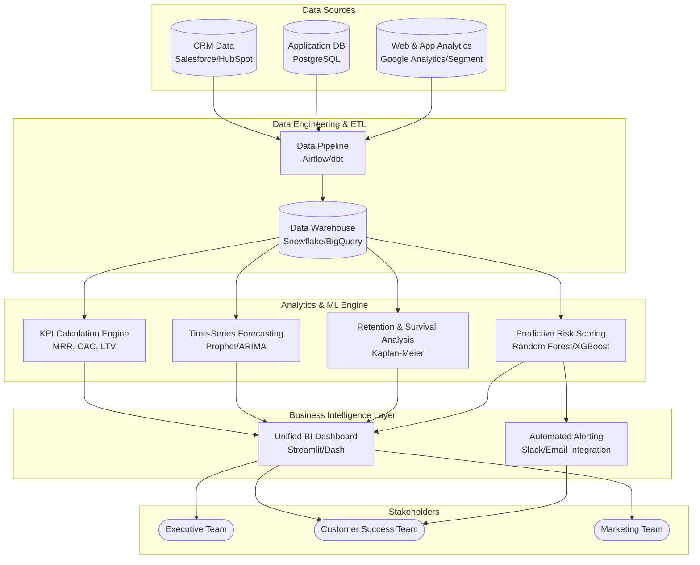

# Unified Customer Intelligence Architecture

This diagram illustrates the data flow and architectural design of the Unified Customer Intelligence Decision System.

```mermaid
graph TD
    subgraph Data Sources
        CRM[(CRM Data\nSalesforce/HubSpot)]
        AppDB[(Application DB\nPostgreSQL)]
        WebLogs[(Web & App Analytics\nGoogle Analytics/Segment)]
    end

    subgraph Data Engineering & ETL
        DataPipeline[Data Pipeline\nAirflow/dbt]
        DataWarehouse[(Data Warehouse\nSnowflake/BigQuery)]
        
        CRM --> DataPipeline
        AppDB --> DataPipeline
        WebLogs --> DataPipeline
        DataPipeline --> DataWarehouse
    end

    subgraph Analytics & ML Engine
        KPICalc[KPI Calculation Engine\nMRR, CAC, LTV]
        Forecasting[Time-Series Forecasting\nProphet/ARIMA]
        Retention[Retention & Survival Analysis\nKaplan-Meier]
        RiskScoring[Predictive Risk Scoring\nRandom Forest/XGBoost]
        
        DataWarehouse --> KPICalc
        DataWarehouse --> Forecasting
        DataWarehouse --> Retention
        DataWarehouse --> RiskScoring
    end

    subgraph Business Intelligence Layer
        StreamlitApp[Unified BI Dashboard\nStreamlit/Dash]
        Alerting[Automated Alerting\nSlack/Email Integration]
        
        KPICalc --> StreamlitApp
        Forecasting --> StreamlitApp
        Retention --> StreamlitApp
        RiskScoring --> StreamlitApp
        
        RiskScoring --> Alerting
    end

    subgraph Stakeholders
        Execs([Executive Team])
        CSM([Customer Success Team])
        Marketing([Marketing Team])
        
        StreamlitApp --> Execs
        StreamlitApp --> CSM
        StreamlitApp --> Marketing
        Alerting --> CSM
    end
```
