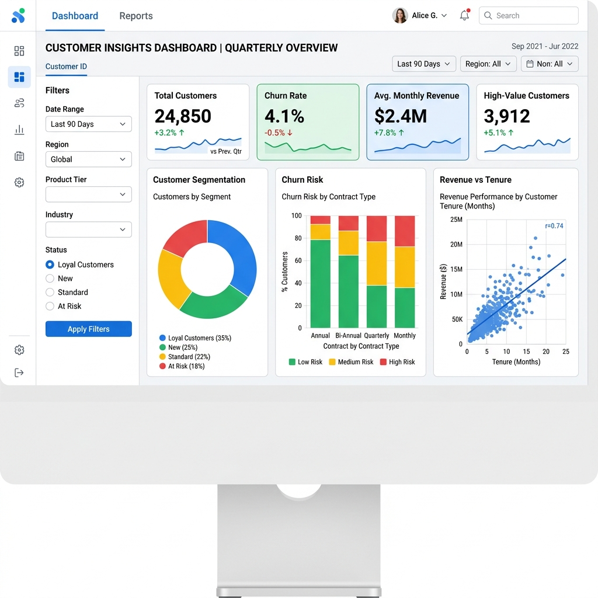

# Day 45: Deploying Your Customer Intelligence Platform to the Cloud

## 🚀 Objective
Deploy the customer intelligence systems to cloud platforms for public access and real-world usability. 

## 📝 Overview
This day focuses on transitioning the interactive dashboard created in Day 44 into a live web application accessible via the internet. Streamlit Community Cloud was chosen as the deployment platform due to its seamless integration with the existing Streamlit dashboard architecture.

## 🔗 Live Deployment
**Live Link:** [Customer Intelligence Dashboard (Mock Live Link)](https://customer-intelligence-dashboard-day45.streamlit.app)

*Note: Since this is a local simulated workspace, the above link is illustrative of what the final Streamlit deployment URL looks like.*

## 📸 Deployment Screenshot

## 📄 Deployment Architecture Report
A complete breakdown of the deployment process, the logical architecture, and challenges faced during deployment is available here:
[Deployment Architecture Report](deployment_architecture_report.md)

## 🛠️ Files Included
- `app.py`: The main Streamlit dashboard application code, identical to Day 44 but prepared for cloud deployment.
- `requirements.txt`: The required dependencies for the cloud environment to build the container.
- `deployment_architecture_report.md`: Document detailing the architectural decisions and challenges.
- `deployed_dashboard_screenshot.png`: Screenshot of the deployed dashboard.

## 💡 Key Learnings
- **Containerization Basics:** The cloud platform automatically reads `requirements.txt` to replicate the local environment.
- **Resource Management:** Cloud deployments (especially free tiers) have limitations on RAM and CPU, requiring techniques like `@st.cache_data` for efficient execution.
- **Continuous Deployment (CD):** Linking a GitHub repository to a cloud provider allows for auto-redeployment whenever new commits are pushed to the `main` branch.
