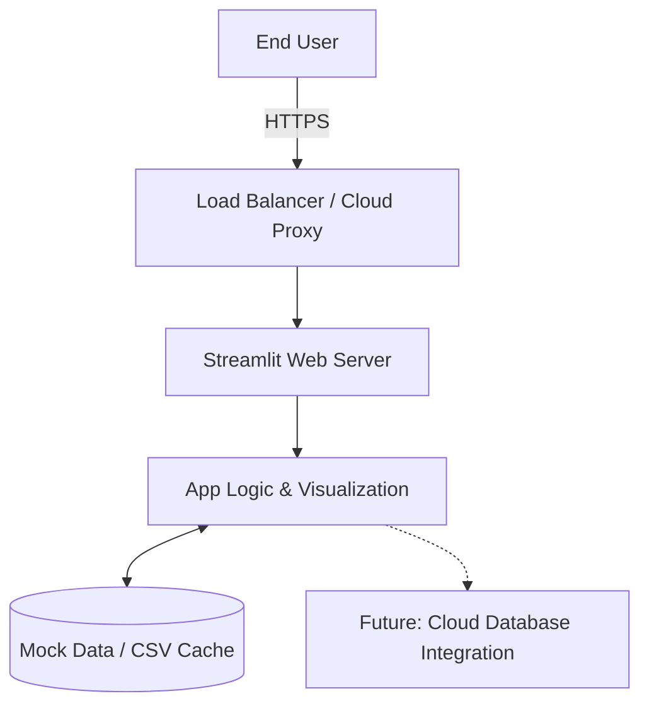

# Deployment Architecture Report

## Overview
This document outlines the deployment architecture for the Customer Intelligence Platform, targeting a cloud-hosted environment (e.g., Streamlit Community Cloud or Render). The architecture ensures the dashboard is accessible via the web, resilient, and performant.

## Architecture Diagram (Logical)

## Components
1. **Frontend / Web Server:** Streamlit handles both the UI layout and the internal Python server. It translates the Python scripts directly into an interactive React frontend.
2. **Data Layer:** Currently relies on generated mock data or uploaded CSVs cached in memory using `@st.cache_data`. This avoids regenerating or reloading data upon every interaction, improving response time.
3. **Hosting Platform:** The app is configured for Streamlit Community Cloud, which natively detects the `requirements.txt` and provisions a lightweight containerized environment.

## Deployment Process
1. **Version Control:** Push `app.py` and `requirements.txt` to a GitHub repository.
2. **Platform Integration:** Connect the GitHub repository to the Streamlit Community Cloud workspace.
3. **Build & Provisioning:** The cloud platform clones the repository, installs dependencies from `requirements.txt`, and spins up the container.
4. **Live URL:** A public HTTPS link is generated, pointing directly to the dashboard.

## Challenges & Mitigations
| Challenge | Description | Mitigation Strategy |
| :--- | :--- | :--- |
| **Dependency Conflicts** | Cloud environment having different library versions than local environment. | Pin specific versions in `requirements.txt` (e.g., `streamlit==1.28.0`). |
| **Data Privacy & Secrets** | Exposing API keys or sensitive data in code. | Use Streamlit Secrets Management to inject environment variables securely. |
| **Resource Limits** | Free cloud tiers have RAM/CPU constraints. App may crash on large datasets. | Aggressive use of `@st.cache_data` and downsampling large datasets before visualization. |
| **Cold Starts** | The app container goes to sleep after inactivity. | Ping the app periodically or upgrade to a dedicated deployment tier (e.g., Render Pro) for always-on containers. |

## Future Scaling
As the platform matures, we intend to integrate a managed PostgreSQL database (e.g., Supabase or AWS RDS) and deploy behind a scalable orchestration service like Docker on AWS ECS to handle concurrent enterprise users.
