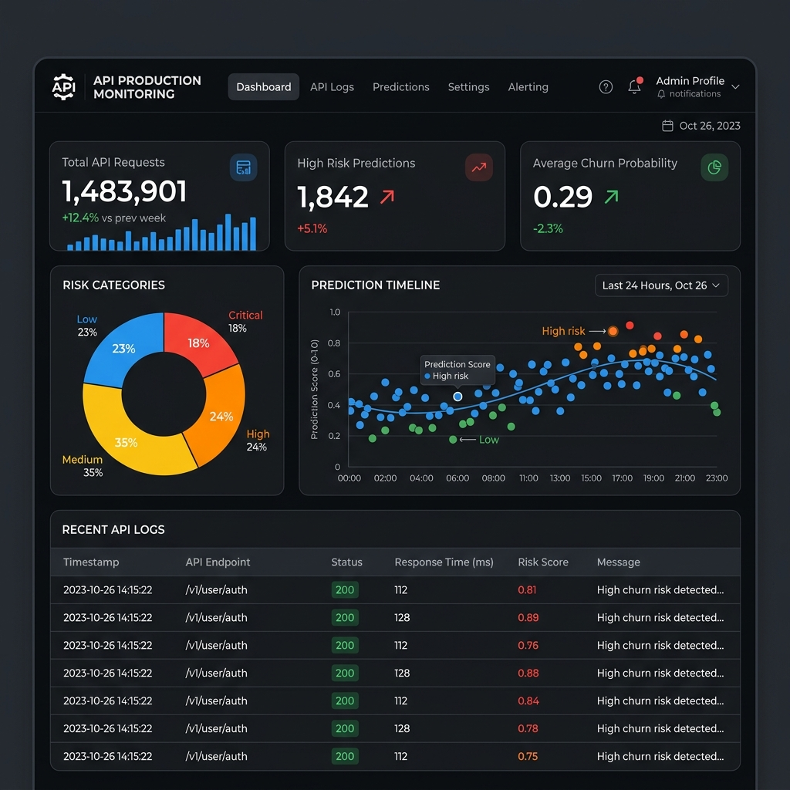

# Day 46: Monitoring Customer Intelligence Systems in Production

## Overview
This phase focuses on improving production reliability for our Customer Intelligence systems. We have enhanced the Model API from Day 43 with production-grade monitoring, comprehensive logging, strict input validation, and exception handling. We also introduced a monitoring dashboard to observe API usage and prediction tracking.

## Features Implemented
1. **Input Validation**: Utilized Pydantic models to strictly validate incoming API payload (ensuring positive values, age limits, proper satisfaction scores).
2. **Comprehensive Logging**: Added logging to capture both the API requests (via middleware) and application-level events, outputting to `logs/api_monitoring.log`.
3. **Exception Handling**: Implemented try/except blocks in the `/predict` endpoint, ensuring API failures translate into meaningful HTTP status codes (`422 Unprocessable Entity` or `500 Internal Server Error`).
4. **Prediction Tracking**: Logged every input data and its resulting prediction payload to a JSON Lines file (`logs/prediction_tracking.jsonl`), assigned with a unique Request ID.
5. **Monitoring Dashboard**: A Streamlit application built to visualize the API traffic, analyze churn probability across incoming requests, and inspect raw API logs.

## Files
- `app.py`: The robust FastAPI application featuring model loading, input validation, and request logging.
- `dashboard.py`: A Streamlit UI to track API health and predictions in real-time.
- `train.py`: Script to train and save the Random Forest model and preprocessors.
- `monitoring_report.md`: A detailed report on the reliability improvements added.

## Instructions to Run

1. **Train the Models**
   Run the training script to generate the models directory and `.pkl` files:
   ```bash
   python train.py
   ```

2. **Start the API Server**
   Start the FastAPI application on port 8000:
   ```bash
   uvicorn app:app --reload
   ```
   *Test the API using the Swagger UI at `http://localhost:8000/docs`.*

3. **Start the Monitoring Dashboard**
   Open a new terminal and run the Streamlit dashboard:
   ```bash
   streamlit run dashboard.py
   ```
   *The dashboard will read from the `logs/prediction_tracking.jsonl` file to visualize the incoming prediction requests.*

## Screenshots

