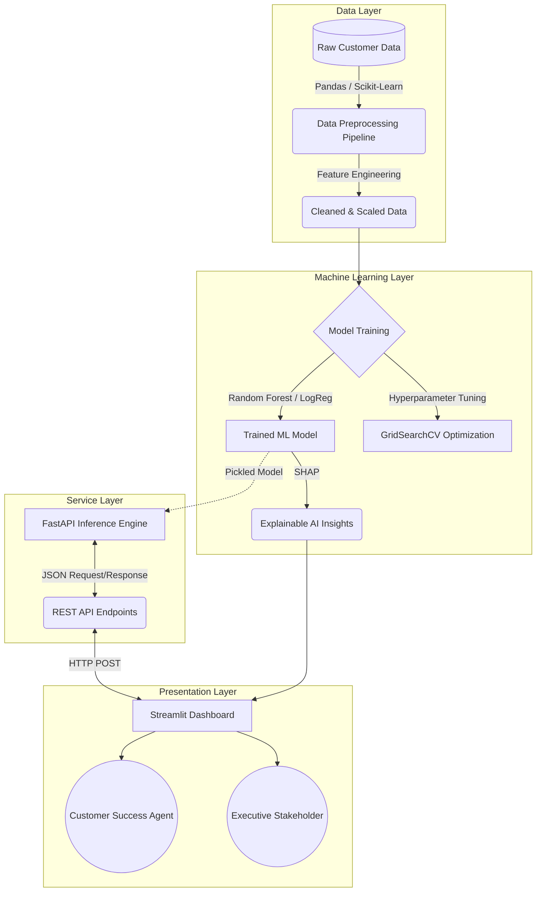

# 🏗️ System Architecture & Workflows

This document outlines the technical architecture of the Customer Intelligence Platform. The system is designed with modularity, scalability, and ease of deployment in mind, cleanly separating the data engineering pipeline, machine learning model, API layer, and frontend interface.

## 1. High-Level Architecture Diagram

The following diagram illustrates the flow of data from the raw CSV input through to the final executive dashboard.

---

## 2. Component Workflows

### Phase 1: Data Engineering Pipeline (Day 48)
* **Goal:** Transform messy raw data into a machine-learning-ready format without data leakage.
* **Mechanism:** We utilize custom `scikit-learn` Pipelines and ColumnTransformers. 
    * Numerical features (Tenure, Charges) are processed through `StandardScaler`.
    * Categorical features (Contract, Payment Method) are transformed via `OneHotEncoder`.
    * Missing values are handled robustly using `SimpleImputer`.
* **Output:** A unified preprocessing artifact (`preprocessor.pkl`) that guarantees identical transformations during training and real-time inference.

### Phase 2: Model Training & Optimization (Day 49 & 50)
* **Goal:** Predict binary customer churn (Yes/No) with high precision and recall.
* **Mechanism:** 
    * Baseline models (Logistic Regression, Random Forest) are trained on the engineered features.
    * Due to class imbalance (fewer churned customers than retained), we focus on PR-AUC (Precision-Recall Area Under Curve) and F1-score rather than simple accuracy.
    * `GridSearchCV` explores the hyperparameter space (e.g., `max_depth`, `n_estimators`) to find the optimal model architecture.

### Phase 3: Explainable AI (Day 51)
* **Goal:** Demystify the "black box" model for business stakeholders.
* **Mechanism:** SHAP (SHapley Additive exPlanations) values are computed to identify global feature importance (e.g., realizing Month-to-Month contracts are the biggest driver of churn) and local importance (e.g., explaining why a specific individual customer was flagged as high risk).

### Phase 4: The Service Layer / API (Day 55)
* **Goal:** Detach the heavy ML model from the UI and provide a highly concurrent inference engine.
* **Mechanism:** Built with **FastAPI** and **Uvicorn**, this layer exposes RESTful endpoints. When a customer payload is received, the API processes it through the saved preprocessing pipeline and model, returning a JSON response containing churn probability, risk tier, and dynamically generated recommended actions based on the score.

### Phase 5: The Presentation Layer (Day 52-54)
* **Goal:** Provide an intuitive interface for end-users without requiring coding knowledge.
* **Mechanism:** Developed using **Streamlit**. It features:
    * **Executive Analytics:** High-level charts (Seaborn/Matplotlib) showing historical churn rates and CLV metrics.
    * **Real-Time Prediction Form:** Customer Success agents input live customer attributes during a call. The UI hits the FastAPI backend and instantly renders conditional formatting (Red Alert for High Risk, Green for Low Risk).

---

## 3. Reliability and Scalability Considerations

* **Stateless API:** The FastAPI backend is completely stateless, meaning it can be horizontally scaled across multiple instances or Docker containers via Kubernetes or AWS ECS to handle high throughput during peak hours.
* **Asynchronous Processing:** Using `async def` in FastAPI allows the server to handle concurrent I/O operations efficiently, preventing blocking when under heavy load.
* **Error Handling:** The API uses Pydantic models for strict data validation. If an agent inputs a negative age or missing contract type, the API instantly returns a 422 Unprocessable Entity error with a clear message, ensuring the ML model never crashes due to malformed data.
